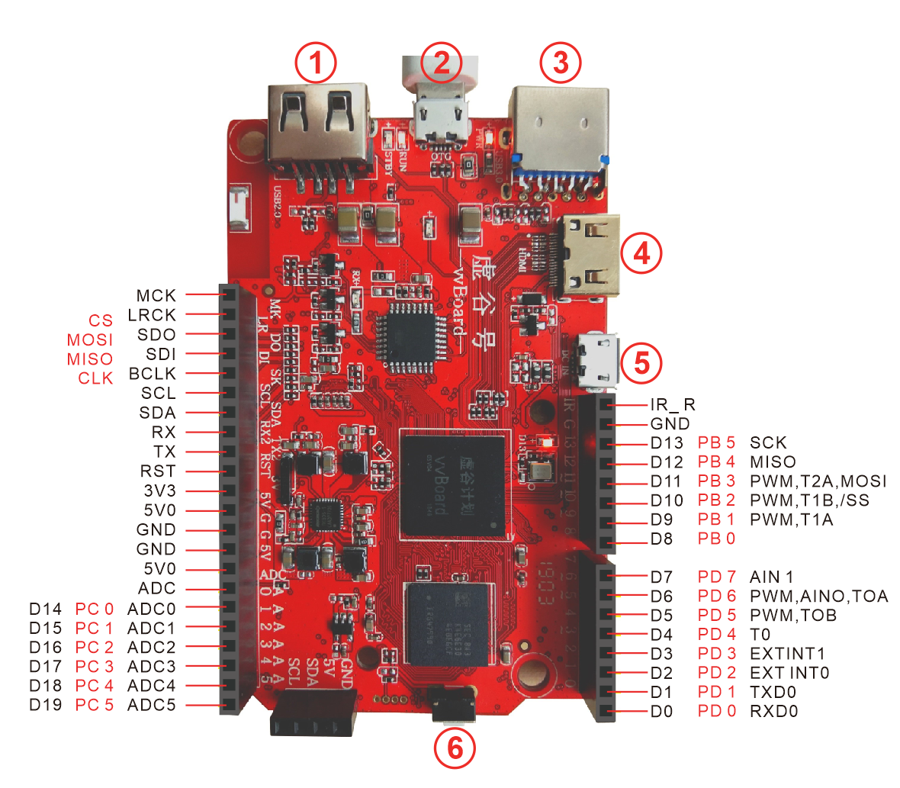
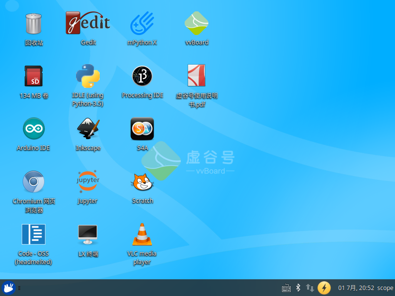
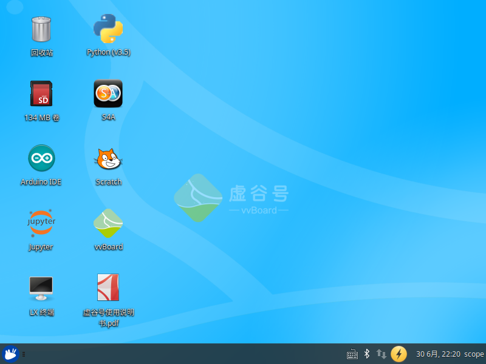

虚谷号的介绍
=============================

虚谷号是一个面向中小学Python编程和人工智能教学而开发的开源硬件，板内集成高性能处理器和通用单片机，内置多功能扩展接口和多种通信接口。

--------------------
功能概述
--------------------

虚谷号的主处理器采用国产高性能4核处理器，主频高达1.5GHz，板载SSD，提供高速大容量运算处理能力，内置Mali-450MP2 GPU,支持OpenGL ES1.1/2.0，拥有优秀的图像处理能力。

.. image:: ../images/01/vvboard03.jpg

虚谷号带有一个USB2.0通用接口，可挂载摄像头等各种通用外设；一个USB3.0接口，提供高速通用的外接通信能力，可挂载大容量高速的硬盘，高速通信的多媒体模组和AI模组；一个USB2.0 OTG接口，此接口向系统供电并可作为使用者的开发接口，以及虚谷号作为从设备的通信接口；一个HDMI接口，提供高清的音视频输出；无线通信模组，提供Wi-Fi（2.4GHz）和蓝牙通信功能。

虚谷号内置国产单片机，用于处理实时事件，扩展接口兼容Arduino UNO，提供多种数字和模拟接口(如1*UART/14*GPIO/4*PWM/6*ADC等)。

虚谷号运行开源的Linux桌面系统，内置Python(jupyter notebook)、Arduino、Processing、Scratch等开发学习软件可以为初高级编程爱好者提供完整的学习和开发环境。

--------------------
系统参数
--------------------

	- SOC系统: Linux ubuntu desktop OS
	- PYTHON: Python3.5.2、jupyter（notebook）
	- CPU: Quad-core Cortex-A53 up to 1.5GHz
	- MCU: 8bit Flash MCU，16-32MHz，兼容Arduino UNO，内置xugu通信协议
	- GPU: Mali-450MP2,支持OpenGL ES1.1/2.0
	- 创客版
		- DDR: 32bit 位宽,1GB,LPDDR3
		- eMMC: 8GB, 支持eMMC 4.41, 4.51, 5.0 and 5.1
	- 教育版
		- DDR: 32bit 位宽,2GB,LPDDR3
		- eMMC: 32GB, 支持eMMC 4.41, 4.51, 5.0 and 5.1

----------------------------
外部硬件接口
----------------------------

	- HDMI: 1,Mini HDMI 2.0a接口*1，支持4K×2K 60Hz显示，HDCP 1.4/2.2；2,3D viedo formats
	- USB: 
		- 1. 1个Micro OTG接口，OTG模式支持U盘模式(device 模式)；
		- 2. 1个Micro USB作备用电源接口；
		- 3. USB2.0、USB3.0接口各一个（HOST A Type）;
	- KEY: Linux系统复位按键
	- WIFI/BT: WIFI IEEE 802.11 b/g/n; Bluetooth V4.0(HS) 
	- LED: 3个LED灯用于指示虚谷号的运行状态

其中标注1、2、3、4、5、6的接口解释如下：

  - 1是USB2.0接口；
  - 2是OTG口，连接电脑的接口；
  - 3是USB3.0接口；
  - 4是HDMI输出接口；
  - 5是DC in接口，是电源输入接口；
  - 6是RESET按键，其功能如下：
		- 未上电时按住reset按键，机器将进入Loader烧写模式。
		- 上电系统启动后，短按reset按键为刷新vvBoard功能。
		- 上电系统启动后，长按reset按键5秒后松开为重启系统功能（初始化U盘文件系统）。

------------------------------
开源硬件接口
------------------------------

	- I2C: 一组I2C，3.3V电平信号，5V供电;
	- ISPI(I2S):1. 一组SPI接口(兼容I2S)，3.3V电平; 2. SPI(I2S)支持主从模式;
	- IUART2:一组UART，兼作虚谷号内核调试，系统信息打印等;
	- IIR_R:一个红外遥控输入接口，输入电平3.3V，提供红外(遥控) 控制接口；
	- ARDUINO接口:全兼容arduino UNO的接口。

如上图所示

----------------------------
预装软件
----------------------------
教育版软件

.. image:: ../images/01/vvboard07.png

教育版桌面

创客版软件

.. image:: ../images/01/vvboard08.png

创客版桌面

