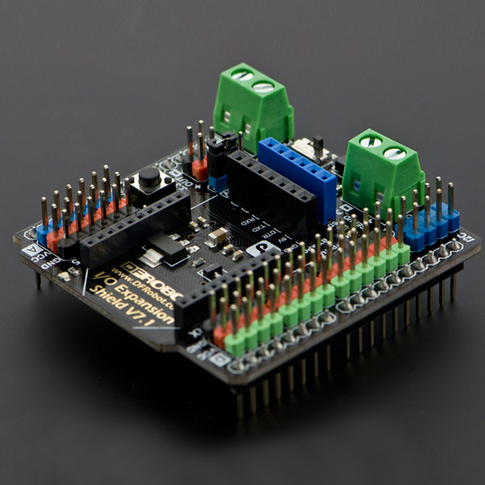

虚谷号的产品生态
=================================

虚谷号不是一个完全独立的教育产品，正如“虚谷计划”的本意——虚怀若谷、兼容并蓄，虚谷号可以完美继承Arduino和树莓派的软硬件生态。

---------------------
硬件方面
---------------------
1）Arduino周边器材

虚谷号板载了一块ATmega328P芯片，和Arduino UNO的芯片完全一致。其针脚也完全兼容UNO。几乎所有兼容Arduino的硬件模块，虚谷号都可以使用。在虚谷号上使用各种传感器，不需要像树莓派一样麻烦需要面板或者专用的扩展板，插上 **标准的Arduino扩展板** 即可使用绝大多数的扩展模块。

如图所示，知名创客企业DFRobot出的Arduino IO传感器扩展板可以和虚谷号完美结合。

Arduino IO 传感器扩展板地址：http://www.dfrobot.com.cn/goods-791.html

你可以通过**虚谷号学习Arduino**。几乎任何一款基于Arduino UNO开发的套件，用虚谷号替换套件中的Arduino主板，就直接成为虚谷号的学习套件了。

2）USB接口硬件

- 摄像头。绝大多数的免驱摄像头，都可以使用在虚谷号上。
- 计算棒。当觉得虚谷号的算力不够强大，可以接上AI计算棒。虚谷号专用的计算棒已经在设计中。
- U盘。当虚谷号的空间不够用时，接上一个普通的U盘即可，当然推荐使用USB3.0以上接口的U盘。
- ……

3）蓝牙接口硬件

4）专用扩展硬件

- DF公司的“厚物扩展板”
- ……

---------------------
软件方面
---------------------

虚谷号的底层操作系统是Ubuntu，支持很多编程语言，如Python、PHP、C、C++、GO等。

能运行在ubuntu和树莓派上的软件，基本上都能够运行在虚谷号上。因为得到一批开源软件爱好者的支持，一些能够运行在Linux系统中的软件都逐步推出了虚谷号版本，如SIoT、mPythonX等。

1）S4A。
	- S4A是Scratch for Arduino的缩写,主要提供了对Arduino和Andriod的支持：采用Arduino作为传感器和执行器的控制平台，提供了6组模拟输入和2组数字输入接口，以及舵机输出和数字输出接口，具有强大的输入和输出的功能；提供了基于HTTP协议的远程传感器功能和安卓手机的配套程序，可以组网互动，也可以和智能手机进行互动。相对于Scratch来说，S4A编写出的作品交互功能更加强大。

2）SmPythonX。
	- mPythonX是一款为掌控板开发的图形化编程的软件，同时支持Python代码编程。

3）Arduino IDE。
	- Arduino包含硬件（各种型号的Arduino主板）和软件（Arduino IDE) 。虚谷号板载了Arduino UNO版本，也内置了Arduino IDE。

4）Jupyter。
	- Jupyter的全称为Jupyter Notebook（此前被称为IPython notebook），是一个交互式笔记本，支持运行40多种编程语言。Jupyter的本质是一个Web应用程序，便于创建和共享类似笔记本的文档，支持实时代码，数学方程，可视化和 markdown。通过Jupyter，可以通过Web页面在虚谷号上运行Python代码和Linux命令。

5）SIoT。
	- SIoT是一款为中小学STEM教育定制的开源MQTT服务器程序，S指科学（Science）、简单（Simple）的意思。SIoT支持Win10、Win7、Mac和Linux等操作系统，一键启动，无需注册和设置即可使用。

6）Processing。
	- Processing是一款专为设计师和艺术家使用的编程语言，由美国麻省理工学院媒体实验室美学与运算小组( Aesthetics Computation Group )的Casey Reas与Ben Fry创立。Processing的出现，被视为艺术设计创作的一场革命。利用Processing，艺术家可以将抽象的数据呈现为生动的视觉形象。它不仅可以生成唯美的图形，还能编写出功能强大的互动艺术作品。

