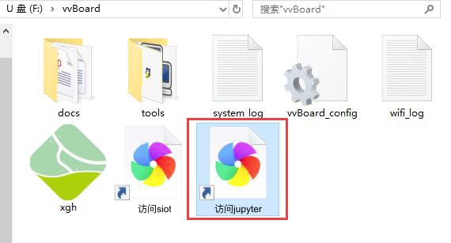
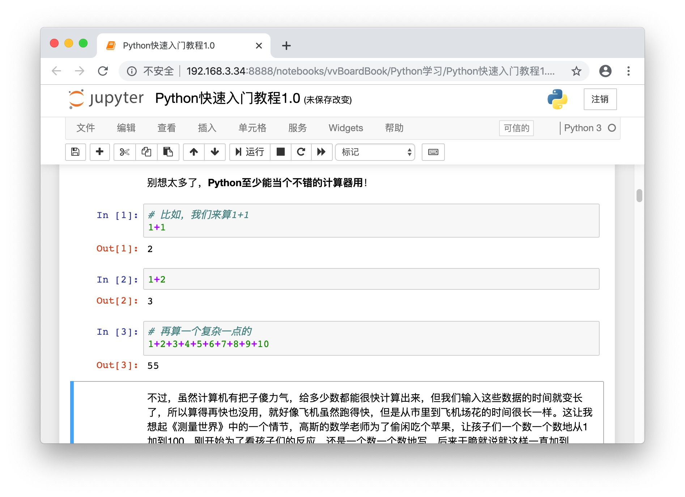
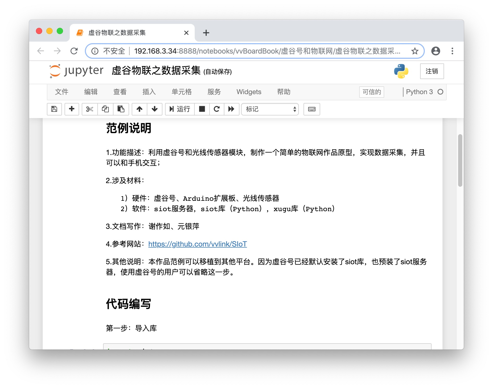

快速入门跟我来
===========================

当你拿到一块全新的虚谷号，不要急着找显示器，接鼠标和键盘。只需要一条USB线，我们就可以使用U盘、无线等模式进行编程。即插即用、快速上手，这是虚谷号的追求。只有这样，虚谷号才算得上一块为中小学教学量身定做的开源硬件。

-------------------------
虚谷号能做什么？
-------------------------

这是一个最重要的问题。虚谷号的定义是面向高年级的学生，是学生熟悉了掌控板、Arduino或者micro:bit等开源硬件之后的学习内容。因此，在创客教育方面有“掌控生虚谷”的说法。

掌控板和Arduino都是属于单片机，功能和算力都有限，做不了太复杂的工作，比如Arduino连上网都做不到，更不要说体验或者学习人工智能了。虽然借助于一些类似AI摄像头的扩展模块，也能做一些智能识别的工作，那毕竟很有限。虚谷号则定位在物联网、人工智能这两个方面，使用标准的Python语言，和高中新教材完全一致。

一般来说，可以分为三大部分：

	- Python编程：学习Python要装太多的库，借助虚谷号可以不用装任何软件，利用浏览器就能学习。
	- 人工智能体验和编程：虚谷号内置了百度AI开放平台，可以实现很多人工智能的应用，打开内置的学习笔记，既可以运行体验，也能修改代码在线编程。
	- 物联网和智能家居：作为“虚谷物联”项目的最重要组成部分，虚谷号内置了SIoT服务器和必要的库，加上GPIO功能，做物联网数据采集和远程控制非常方便。

-------------------
推荐学习路径
-------------------

不同用户，学习虚谷号的路径是不同的。

1.已经有树莓派之类的学习经验的用户

可以直接使用主机模式（电脑模式）。

2.有Arduino、掌控板编程经验的用户

建议使用U盘模式和无线模式。

3.零基础用户。

建议使用无线模式。

**注意：**

不管是哪一类用户，我们都强烈推荐使用**无线模式给虚谷号编程**。

-------------------------
设置Wi-Fi
-------------------------

需要准备一个无线路由器，让电脑和虚谷号连接同一个Wi-Fi信号，相互之间可以访问。还需要一条USB线，micro usb口的，就是那种随处可见的手机充电线。

给虚谷号设置Wi-Fi的基本步骤：

1.将USB线连至虚谷号的OTG口。

.. image:: ../images/02/2-01.jpg
 
2.稍后系统会将虚谷号识别为一个U盘。

.. image:: ../images/02/2-02.jpg

3.打开vvBoard的文件夹，找到vvBoard_config文件。

.. image:: ../images/02/2-03.jpg

4.用记事本编辑vvBoard_config文件。

.. image:: ../images/02/2-05.jpg
 
将SSID和SSID_PSD改为局域网的WIFI账号密码，保存配置文件。
5.按下虚谷号的RST键，U盘会暂时消失，等再次出现时，vvBoard的文件夹会出现两个新的快捷方式。

 
双击“访问Jupyter”，此时浏览器将打开Jupyter的登录页面，登陆密码为“scope”。在Jupyter的界面下，可以给虚谷号编程、安装软件，更重要的是，可以访问虚谷号内置的课程笔记，快速入门。

-------------------------
开始Python编程
-------------------------

打开Jupyter，将看到虚谷号中内置很多笔记，这些笔记可以作为课程来使用。

.. image:: ../images/02/2-07.jpg

可以看一下由张路、谢作如编写的《Python快速入门教程》，用鼠标选中代码，点击上方的“运行”即可看到运行效果。

-------------------------
体验人工智能
-------------------------

虚谷号内置了百度AI开放平台，可以实现很多人工智能的应用，打开内置的学习笔记，既可以运行体验，也能修改代码在线编程。

.. image:: ../images/02/2-09.jpg

**注**：虚谷号中提供了一个公用的百度AI用户，可能受到百度AI平台“申请次数过多”的限制，建议申请一个百度AI平台用户，然后修改代码中的用户参数。

------------------------------
物联网和智能家居
------------------------------

虚谷号内置了SIoT服务器和SIoT库，加上GPIO功能，做物联网数据采集和远程控制非常方便。

关于虚谷物联的更多内容，请访问：https://github.com/vvlink/SIoT

-----------------------------
关于虚谷号入门的问和答
-----------------------------

常常接到各种求助，在这里做一下总结：

1。拿到一块全新的虚谷号，开始学习前还要做什么准备？

答：一条USB线，一个Wi-Fi信号，你就可以开始学习了。对了，你的电脑要装谷歌浏览器。

2.虚谷号入门需要多少时间？

答：如果有Python基础，直接入门；如果有linux基础，那说明早入门了；如果接触过Arduino、掌控板，那需要熟悉一下代码编程，学习时间是花在学习语言上，不是花在虚谷号上。在虚谷号自带的Jupyter课程的支持下，做一个人工智能的应用，30分钟就可以了。

3.虚谷号有教学课程吗？

答：虚谷号本来就是一台迷你电脑，任何关于linux、Python、PHP之类的课程，都可以是虚谷号的课程。同时，虚谷号自带了Arduino，绝大多数Arduino的课程，也可以直接用在虚谷号上。当然，虚谷号在教学应用方面做了很多优化，内置了常见的库。部分虚谷号测评专家，写了一些机遇Jupyter的课程，能够作为课程来使用。

4.虚谷号适合哪些人使用？

答：虚谷号面向高年级学生，重点关注Python代码编程。可以将虚谷号看成是一台“linux电脑+Arduino”，用linux系统处理复杂的信息，用Arduino来获取传感器信息和控制各种执行器。在虚谷号的帮助下，无论是物联网还是人工智能作品，都可以快速搭建。

