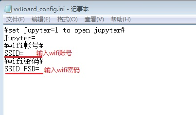
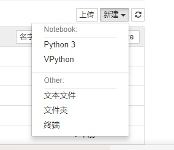
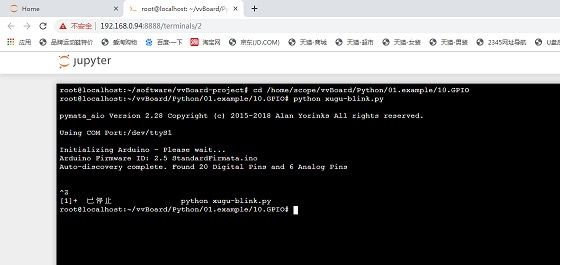
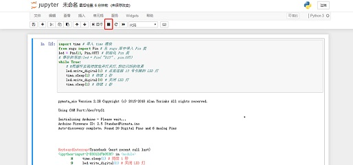
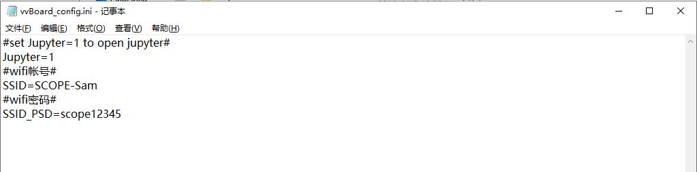
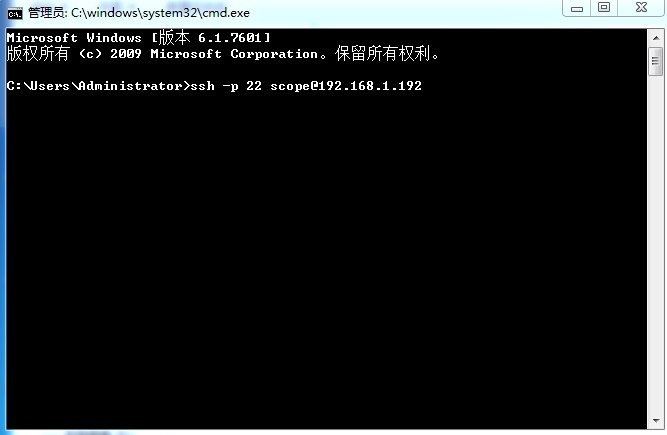
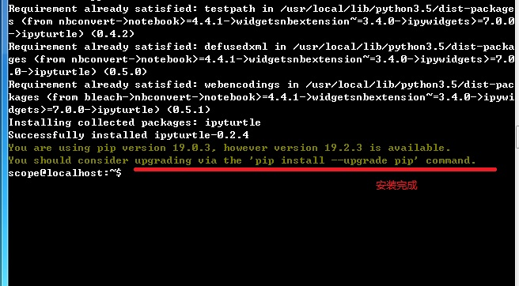
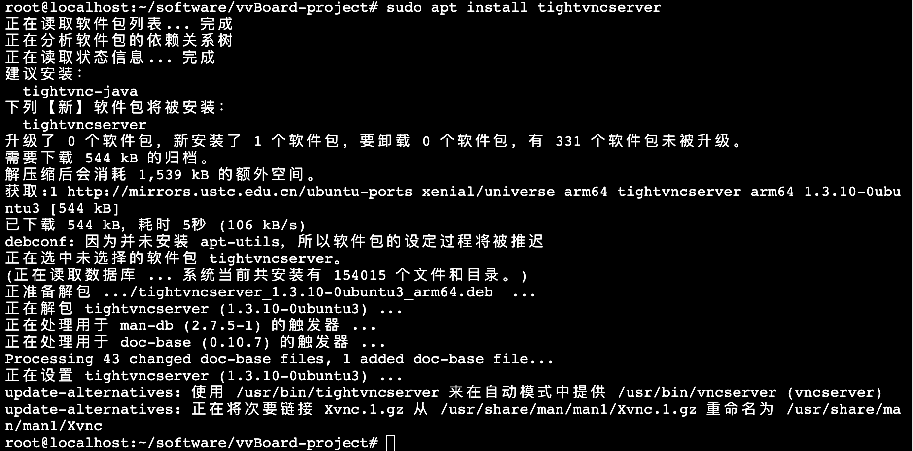
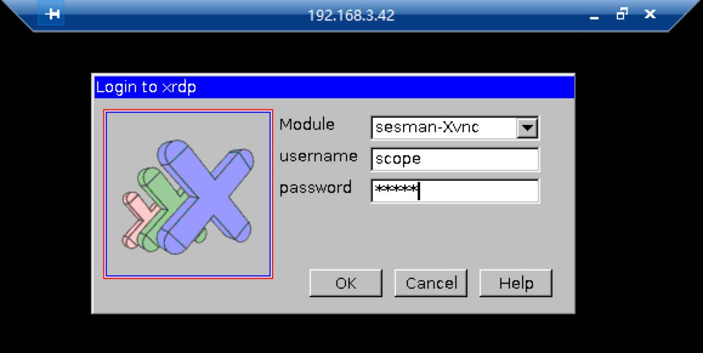
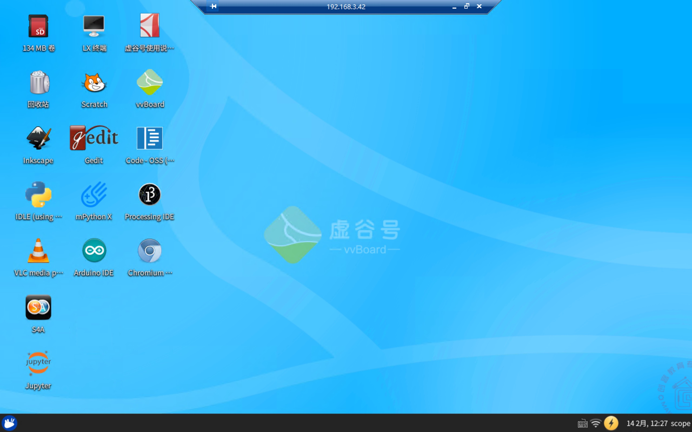

无线模式
===========================

通过U盘模式可以给虚谷号设置Wi-Fi、编程等，如果要安装Python库或者安装其他应用软件，就要借助“无线模式”了。

虚谷号内置了SSH和jupyter服务，在连接Wi-Fi的情况下，可以不用接鼠标键盘，即可实现对虚谷号的完全控制，如运行Python程序，给Arduino刷写代码，安装和卸载Python库文件、系统软件等。

新版固件中，虚谷号已经默认安装远程桌面服务。用windows自带的远程桌面访问，非常方便。

---------------------------------
应用场景
---------------------------------

在不需要接鼠标键盘的前提下，通过修改vvBoard_config.ini文件设置SSID和密码，即可用无线模式来管理虚谷号，如：

	- 通过Web页面给虚谷号编写代码；
	- 通过终端命令安装或者卸载软件；
	- 通过终端命令安装Python库；
	- 在线调试Python代码、管理进程；
	- 熟悉linux命令；

---------------------------------------
如何连接Wi-Fi
---------------------------------------

步骤1:

通过USB线将虚谷板（OTG口）连接上电脑，约十多秒后，电脑会出现一个名为vvBoard的U盘。用记事本打开vvBoard文件夹中的vvBoard_config.ini文件，在“SSID=”和“SSID_PSD=”输入信息。




步骤2:

短按虚谷板的RST键，U盘会暂时消失，等到U盘图标再次出现，一般就已经连上了Wi-Fi。

注意：

	- 目前虚谷号仅支持2.4GHz的Wi-Fi。如果Wi-Fi需要二次身份认证（如校园网等），只能通过电脑模式连接，不能用U盘模式配置。在修改完vvBoard_config文件后，如果短按RST键后没有连接成功，可以多尝试几次。如果还不行，请仔细检查vvBoard_config文件中的内容是否被正确地修改，可以尝试将虚谷号断电重启，或长按RST键5秒重启，初始化U盘文件。
	- 有些公用的Wi-Fi并没有设置密码。请在“SSID_PSD=”处输入两个英文状态下的引号，即“SSID_PSD=''”。

步骤3:

打开vvBoard文件夹中的wifi_log.txt文件，找到IP地址。如下面的信息表示IP地址是“192.168.1.192”。

::

	设备    类型      状态    连接     
	wlan0   wifi      已连接  scope 
	dummy0  dummy     未托管  --       
	lo      loopback  未托管  --       
	wlan0     Link encap:以太网  硬件地址 18:93:7f:33:94:10  
          inet 地址:192.168.1.192  广播:192.168.1.255  掩码:255.255.255.0
		  inet6 地址: fe80::bc0d:9279:5c93:604c/64 Scope:Link
		  UP BROADCAST RUNNING MULTICAST  MTU:1500  跃点数:1
		  接收数据包:7 错误:0 丢弃:0 过载:0 帧数:0
		  发送数据包:7 错误:0 丢弃:0 过载:0 载波:0
		  碰撞:0 发送队列长度:1000 
		  接收字节:2465 (2.4 KB)  发送字节:1163 (1.1 KB)
		
**注意：** 

如果在Wi-Fi配置信息中找不到IP地址，很有可能是虚谷号的DAP系统启动速度太快，而虚谷号要连接的路由器速度有点慢，导致IP地址还没来得及成功分配就启动进入了U盘模式。遇到这种情况，请再按一次RST键，让U盘文件系统重新读取一次IP信息。


-------------------------------------------------
Jupyter服务
-------------------------------------------------

Jupyter的全称为Jupyter Notebook（此前被称为IPython notebook），是一个交互式笔记本，支持运行40多种编程语言。Jupyter的本质是一个Web应用程序，便于创建和共享类似笔记本的文档，支持实时代码，数学方程，可视化和 markdown。通过Jupyter，可以通过Web页面在虚谷号上运行Python代码和Linux命令。

步骤1:访问Jupyter

在浏览器输入http://【虚谷号IP】:8888，即可打开一个页面，输入密码scope。

.. image:: ../images/02/wifi03.jpg

步骤2:运行Linux命令

通过“新建”-“终端”，即可打开一个仿真的终端页面，使用方法和终端基本一致。



.. image:: ../images/02/wifi07.jpg


步骤3:运行Python代码

运行Python代码有多种方式。

方式1:通过Linux命令



方式2:通过笔记运行代码

.. image:: ../images/02/wifi12.jpg

方式3:通过笔记运行外部文件



注：如何关闭Jupyter功能？

修改config中，jupyter=0，默认jupyter=1。

Jupyter是学习Python程序员的好帮手，很多关于数据分析的课程，都是用Jupyter写的。更多关于Jupyter的功能应用，请参考本文档的第五部分。虚谷号团队也开发、收集了一些Jupyter的课程笔记，打开Jupyter应用即可看到。




-------------------------------
SSH服务
-------------------------------

虚谷号默认启动了SSH功能。通过SSH功能，用户可以安装、卸载软件，如管理jupyter或者VNC。也可以安装Python库，只要熟悉Linux命令，可以对虚谷号做任何工作。

以安装Python库为例，虚谷号的ip地址为192.168.1.192。

步骤1：连接ssh

在CMD窗口输入：ssh -p 22 scope@192.168.1.192



步骤2：安装Python库

.. image:: ../images/02/wifi09.jpg




---------------------------------------------------
远程桌面服务
---------------------------------------------------

虚谷号的“远程桌面服务”，即Xrdp服务，是Microsoft远程桌面协议 (RDP) 的开源版本，允许用户以图形方式控制远程系统。使用RDP登录到远程计算机并创建一个真实的桌面会话，就像已登录到本地计算机一样。

注：2020年3月的固件，将预装了“远程桌面服务”。

````````````````````````
通过jupyter安装
````````````````````````

在jupyter的界面中，新建一个终端，然后输入如下命令：

::
	sudo apt install xrdp

	sudo apt install tightvncserver


.. image:: ../images/02/2.2-wifi-10.png



```````````````````
通过ssh安装
```````````````````

连接SSH后，同样输入如下命令：

::

	sudo apt install xrdp

	sudo apt install tightvncserver


```````````````````
使用方法
```````````````````

用win自带的mstsc.exe远程桌面软件即可连接，用户名和密码都是scope。这时看到的桌面和直接使用显示屏连接虚谷号看到的是一样的。








**远程连接问题**

如果遇到远程连接问题，请参考以下解决方案。

https://github.com/vvlink/vvBoard-docs/blob/master/source/08.advanced/8.1-troubleshooting.rst

**注意：**

如果无线模式需要修改vvBoard盘里面的东西，需要断开OTG口的连接，使用电源口供电。因为OTG口供电，系统将处于U盘模式，vvBoard盘将锁定。


