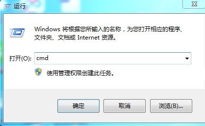

无线模式
===========================

虚谷号内置了SSH和jupyter服务，在连接Wi-Fi的情况下，可以不用接鼠标键盘，即可实现对虚谷号的完全控制，如运行Python程序，给Arduino刷写代码，安装和卸载Python库文件、系统软件等。

---------------------------------
应用场景
---------------------------------

在不需要接鼠标键盘的前提下，通过修改vvBoard_config.ini文件设置SSID和密码，即可用无线模式来管理虚谷号，如：

- 通过Web页面给虚谷号编写代码；
- 通过终端命令安装或者卸载软件；
- 通过终端命令安装Python库；
- 在线调试Python代码、管理进程；
- 熟悉linux命令；

---------------------------------------
如何连接Wi-Fi
---------------------------------------

步骤1:

通过USB线将虚谷板（OTG口）连接上电脑，约十多秒后，电脑会出现一个名为vvBoard的U盘。用记事本打开vvBoard文件夹中的vvBoard_config.ini文件，在“SSID=”和“SSID_PSD=”输入信息。

.. image:: ../images/02/u-driver02.jpg

步骤2:

短按虚谷板的RST键，U盘会暂时消失，等到U盘图标再次出现，一般就已经连上了Wi-Fi。

步骤3:

打开vvBoard文件夹中的wifi_log.txt文件，找到IP地址。如下面的信息表示IP地址是“192.168.1.192”。

：：

	lo        Link encap:本地环回  
	          inet 地址:127.0.0.1  掩码:255.0.0.0
	          inet6 地址: ::1/128 Scope:Host
	          UP LOOPBACK RUNNING  MTU:65536  跃点数:1
	          接收数据包:116 错误:0 丢弃:0 过载:0 帧数:0
	          发送数据包:116 错误:0 丢弃:0 过载:0 载波:0
	          碰撞:0 发送队列长度:1 
	          接收字节:9792 (9.7 KB)  发送字节:9792 (9.7 KB)

	wlan0     Link encap:以太网  硬件地址 18:93:7f:33:94:10  
	          inet 地址:192.168.1.192  广播:192.168.1.255  掩码:255.255.255.0
	          inet6 地址: fe80::bc0d:9279:5c93:604c/64 Scope:Link
	          UP BROADCAST RUNNING MULTICAST  MTU:1500  跃点数:1
	          接收数据包:7 错误:0 丢弃:0 过载:0 帧数:0
	          发送数据包:7 错误:0 丢弃:0 过载:0 载波:0
	          碰撞:0 发送队列长度:1000 
	          接收字节:2465 (2.4 KB)  发送字节:1163 (1.1 KB)

**注意：** 如果在Wi-Fi配置信息中找不到IP地址，很有可能是U盘启动速度太快，IP地址还没来得及分配，请再按一次RST键。

-------------------------------------
SSH功能
-------------------------------------

虚谷号默认启动了SSH功能。通过SSH功能来安装卸载软件，如管理jupyter或者VNC。也可以安装Python库，只要熟悉Linux命令，可以对虚谷号做任何工作。

以安装Python库为例，虚谷号的ip地址为192.168.1.192。

步骤1：连接ssh

在CMD窗口输入：ssh -p 22 scope@192.168.1.192

.. image:: ../images/02/wifi02.jpg

步骤2：安装Python库

.. image:: ../images/02/wifi09.jpg

.. image:: ../images/02/wifi10.jpg

---------------------------------------------------
Jupyter功能
---------------------------------------------------

Jupyter的全称为Jupyter Notebook（此前被称为IPython notebook），是一个交互式笔记本，支持运行40多种编程语言。Jupyter的本质是一个Web应用程序，便于创建和共享类似笔记本的文档，支持实时代码，数学方程，可视化和 markdown。通过Jupyter，可以通过Web页面在虚谷号上运行Python代码和Linux命令。

步骤1:访问Jupyter

在浏览器输入http://【虚谷号IP】:8888，即可打开一个页面，输入密码scope。

.. image:: ../images/02/wifi03.jpg

步骤2:运行Linux命令

.. image:: ../images/02/wifi06.jpg

.. image:: ../images/02/wifi07.jpg

步骤3:运行Python代码

运行Python代码有多种方式。

 - 方式1:通过Linux命令

【截图】

 - 方式2:通过笔记运行代码

【截图】

 - 方式3:通过笔记运行外部文件

【截图】

注：如何关闭Jupyter功能？

修改config中，默认jupyter=1。

Jupyter是学习Python程序员的好帮手，很多关于数据分析的课程，都是用Jupyter写的。更多关于Jupyter的功能应用，请参考本文档的第五部分。虚谷号团队也开发、收集了一些Jupyter的课程笔记，打开Jupyter应用即可看到。

.. image:: ../images/02/wifi04.jpg

---------------------------------------------------
通过SSH开启远程桌面
---------------------------------------------------

通过SSH，可以开启远程桌面（tightvncserver）。

连接SSH后，输入如下命令：

	- sudo apt install xrdp

	- sudo apt install tightvncserver

使用：

用win自带的mstsc.exe远程桌面连接即可，用户名和密码都是scope。

