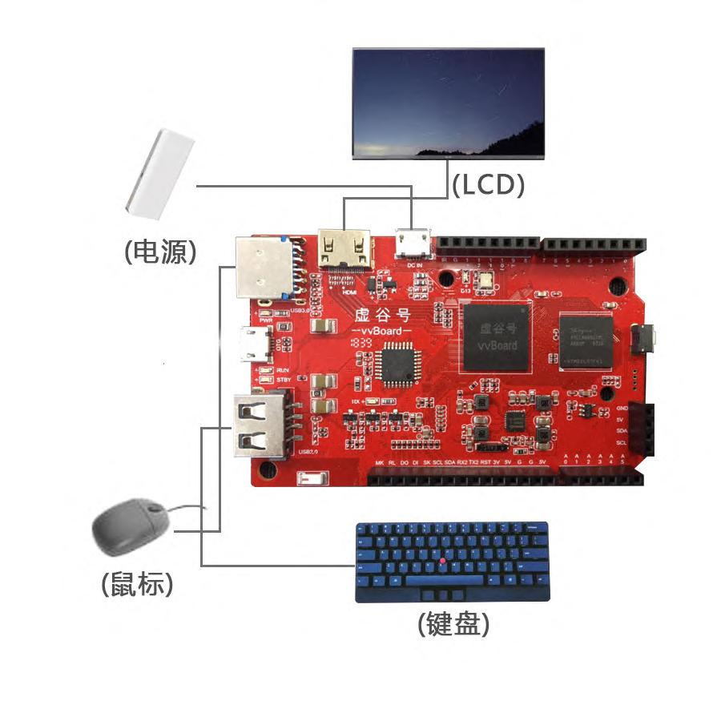
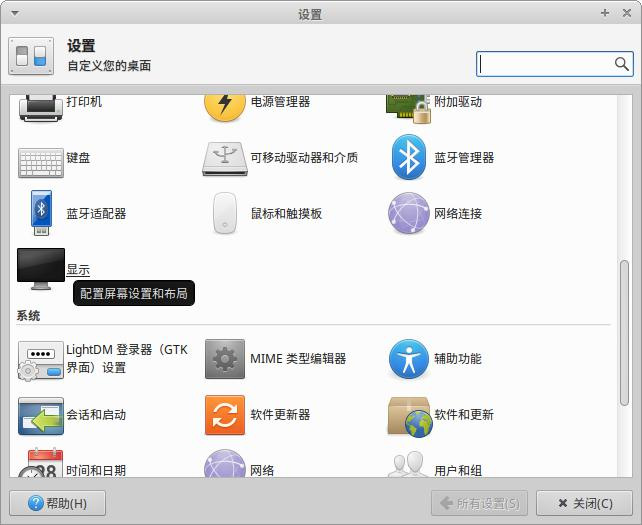

PC模式
===========================

虚谷号的PC模式也称电脑模式。虚谷号是一台迷你电脑，接上鼠标键盘和显示器，就是一台完整的电脑。

------------------------------------------------
应用场景
------------------------------------------------
接上显示器和鼠标键盘还有电源后，虚谷号即可变成一台电脑，虚谷号主板相当于电脑主机，系统使用linux系统。

连接方式如下：

-------------------------------------------------
通过电脑模式可以做什么
-------------------------------------------------

1）在桌面给虚谷号编写代码

2）安装或者卸载软件

3）安装Python库

4）调试代码、管理进程

5）熟悉linux命令

6）体验桌面用程序  

------------------------------------------------
电脑模式基本操作
------------------------------------------------

1）在终端输入uname可以查看vvBoard相关资料。

【截图】

2）在终端输入ls /dev可以查看插入的串口设备串口

【截图】

3）修改显示屏的分辨率

（1）点击桌面左下角图标，在打开的界面中单击设置图标，显示界面如下：

（2）点击显示设置，设置对应的分辨率后点击应用完成分辨率设置

.. image:: ../images/02/pc03.jpg

4）快捷键的操作说明：

 - Ctrl+Alt+t:打开终端
 
 - Ctrl+空格键：更改输入法
 
 - Ctrl+c:结束终端运行
 
 - Alt+PrintScreenSysRq:截屏

 - Ctrl+w:关闭当前窗口

 - Ctrl+a:全选
 
 - Ctrl+s:保存

 - Ctrl+c:复制
 
 - Ctrl+x:剪切
 
 - Ctrl+v:粘贴

**注**：更多Linux命令，请访问本文档的第三部分。

