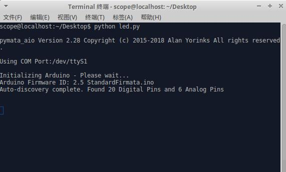

Python运行和库维护
==================================

虚谷号默认安装的是Python3.5，可以通过多种方式来运行。

--------------------------------
通过U盘方式运行
--------------------------------

1）将虚谷板连接上主机

2）连接好之后在屏幕的右下角可以看到一个U盘图标

3）打开此U盘后会看到目录结构

4）进入到Python目录下新建一个test.py文件

5）打开此文件编辑一个python代码（也可在其它编辑器上写完后粘贴过来）保存

6）打开python_config.ini文件，修改Python=test.py并保存。

7）短按虚谷板的reset按键等待虚谷号U盘刷新

8）待vvBoard刷新后进入到Python文件夹下会看到一个python_log文件，python程序的输出内容还有错误信息全都保存在此文件中，打开此文件会发现python程序打印的hello world保存在了此文件中

  注：目前系统版本运行python程序输出对应log到python_log.txt的功能暂时关闭

--------------------------------
通过无线方式运行
--------------------------------

1.
2.
3.

--------------------------------
通过PC模式运行python
--------------------------------
1.使用编辑器运行python程序
			
      Python(3.5)是Python的编辑器，可以在里面进行编译执行。

2.使用终端运行.py文件
    
    创建一个.py文件，在终端输入Python xxx.py运行，例：D13LED 灯亮2秒熄灭4秒的闪烁
操作步骤：

a.在桌面创建一个文件，命名为led.py

b.打开led.py，手动输入下面方框内的代码（或将桌面vvBoard里的Python\01.example\10.GPIO\xugu_blink.py文件内容复制到led.py内，并改成和下面的代码一样），保存关闭。 
                         
                         import time  # 导入time模块
                         
                         from xugu import LED  # 从xugu库中导入LED类
                         
                         led = LED(13)  # 初始化LED类
                         
                         while True:   # 用循环实现持续地开灯关灯，到达闪烁的效果
                             
                             led.on()  # 点亮连接13号引脚的LED灯
                             
                             time.sleep(2) # 持续2秒
                             
                             led.off()  # 关闭LED灯
                            
                             time.sleep(4)  # 持续4秒
                            
c.在桌面空白处右击，选择Open Terminal Here，则会打开终端

d.输入python led.py，按下回车键（Eenter），稍等一会，出现如下图所示：

e.执行成功，D13LED灯会亮2秒熄灭4秒的闪烁。关闭窗口

------------------------------------
虚谷号默认安装的库列表
------------------------------------

 
Package-----------------------Version-------------------Location                              
 
absl-py-----------------------0.7.0                  

astor-------------------------0.7.1                  

attrs-------------------------18.2.0                 

autobahn----------------------18.12.1                

Automat-----------------------0.7.0                  

backcall----------------------0.1.0                  

baidu-aip---------------------2.2.13.0               

beautifulsoup4----------------4.4.1                  

bleach------------------------3.0.2                  

catfish-----------------------1.4.2                  

chardet-----------------------2.3.0                  

Click-------------------------7.0                    

command-not-found-------------0.3                    

constantly--------------------15.1.0                 

cycler------------------------0.10.0                 

Cython------------------------0.29.6                 

decorator---------------------4.3.0                  

defer-------------------------1.0.6                  

defusedxml--------------------0.5.0                  

entrypoints-------------------0.2.3                  

Flask-------------------------1.0.2                  

gast--------------------------0.2.2                  

grpcio------------------------1.19.0                 

h5py--------------------------2.9.0                  

html5lib----------------------0.999                  

hyperlink---------------------18.0.0                 

idna--------------------------2.8                    

incremental-------------------17.5.0                 

ipykernel---------------------4.10.0                 

ipython-----------------------7.2.0                  

ipython-genutils--------------0.2.0                  

ipywidgets--------------------7.4.2                  

itsdangerous------------------1.1.0                  

jedi--------------------------0.13.2                 

Jinja2------------------------2.10                   

jsonschema--------------------2.6.0                  

jupyter-----------------------1.0.0                  

jupyter-client----------------5.2.4                  

jupyter-console---------------6.0.0                  

jupyter-core------------------4.4.0                  

Keras-------------------------2.2.4                  

Keras-Applications------------1.0.7                  

Keras-Preprocessing-----------1.0.9                  

kiwisolver--------------------1.0.1                  

language-selector-------------0.1                    

lightdm-gtk-greeter-settings--1.2.1                  

lxml--------------------------3.5.0                  

Markdown----------------------3.0.1                  

MarkupSafe--------------------1.1.0                  

matplotlib--------------------3.0.2                  

menulibre---------------------2.1.3                  

mistune-----------------------0.8.4                  

mpmath------------------------1.1.0                  

mugshot-----------------------0.3.1                  

nbconvert---------------------5.4.0                  

nbformat----------------------4.4.0                  

notebook----------------------5.7.4                  

numpy-------------------------1.16.2                 

onboard-----------------------1.2.0                  

pandas------------------------0.23.4                 

pandocfilters-----------------1.4.2                  

parso-------------------------0.3.1                  

pexpect-----------------------4.0.1                  

pickleshare-------------------0.7.5                  

Pillow------------------------3.1.2                  

pip---------------------------18.1                   

prometheus-client-------------0.5.0                  

prompt-toolkit----------------2.0.7                  

protobuf----------------------3.7.0                  

psutil------------------------3.4.2                  

ptyprocess--------------------0.5                    

pycups------------------------1.9.73                 

pycurl------------------------7.43.0                 

pyFirmata---------------------1.1.0                  

pyflakes----------------------2.1.1                  

pygame------------------------1.9.4                  

Pygments----------------------2.3.1                  

pygobject---------------------3.20.0                 

PyHamcrest--------------------1.9.0                  

pymata-aio--------------------2.28                   

PyMySQL-----------------------0.9.3                  

pyparsing---------------------2.3.0                  

pyserial----------------------3.4                    

python-apt--------------------1.1.0b1+ubuntu0.16.4.3 

python-dateutil---------------2.7.5                  

python-debian-----------------0.1.27                 

python-systemd----------------231                    

pytz--------------------------2018.7                 

pyxdg-------------------------0.25                   

PyYAML------------------------3.13                   

pyzmq-------------------------17.1.2                 

qtconsole---------------------4.4.3                  

redis-------------------------3.0.1                  

reportlab---------------------3.3.0                  

requests----------------------2.9.1                  

scikit-learn------------------0.20.3                 

scipy-------------------------0.17.0                 

Send2Trash--------------------1.5.0                  

sessioninstaller--------------0.0.0                  

setuptools--------------------33.1.1                 

six---------------------------1.12.0                 

ssh-import-id-----------------5.5                    

sympy-------------------------1.3                    

system-service----------------0.3                    

tensorboard-------------------1.9.0                  

tensorflow--------------------1.9.0                  

termcolor---------------------1.1.0                  

terminado---------------------0.8.1                  

testpath----------------------0.4.2                  

tornado-----------------------5.1.1                  

traitlets---------------------4.3.2                  

turtle------------------------0.0.2---------------------/usr/local/lib/python3.5/dist-packages

Twisted-----------------------18.9.0                 

txaio-------------------------18.8.1                 

ubuntu-drivers-common---------0.0.0                  

unattended-upgrades-----------0.1                    

urllib3-----------------------1.13.1                 

vpnotebook--------------------0.1.3                  

wcwidth-----------------------0.1.7                  

webencodings------------------0.5.1                  

websockets--------------------7.0                    

Werkzeug----------------------0.14.1                 

wheel-------------------------0.29.0                 

widgetsnbextension------------3.4.2                  

xkit--------------------------0.0.0                  

zope.interface----------------4.6.0                  

zxing-------------------------0.9.3      

