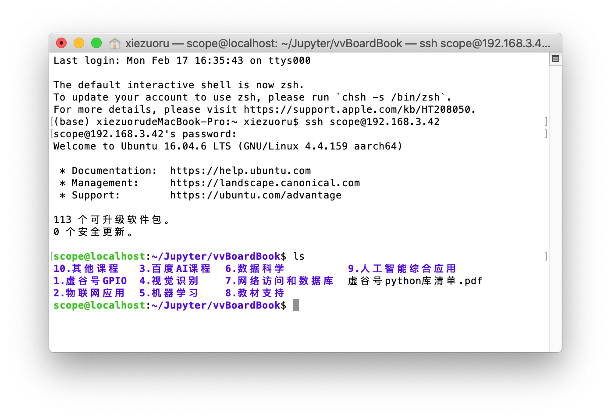
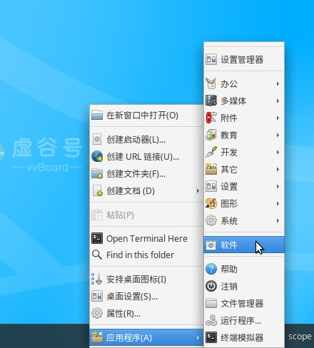
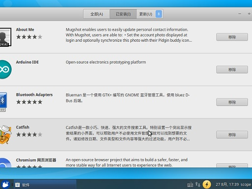

软件安装和卸载
===============================

虚谷号已经默认安装了一系列和教育相关的常见工具，以及编程工具。如果需要安装新的软件，可以通过无线模式和主机模式进行。

在ubuntu中，可以用apt或者apt-get命令来安装、卸载软件，具体做法类似手机的app安装和卸载，关键是要知道软件的名称。另外，为了提高安装软件的速度，建议更换apt的源，推荐清华源。

------------------------------------
通过无线模式
------------------------------------

1.利用Jupyter服务。

打开Jupyter，通过“新建”-“终端”，切换到终端命令窗口。

（1）安装软件

参考命令：

sudo apt-get install softname1 softname2 …;

sudo apt install softname1 softname2 …;

（2）卸载软件

参考命令：

sudo apt-get remove softname1 softname2 …;

sudo apt remove

注：  sudo密码为scope

2.利用SSH：

通过SSH，可以使用终端命令安装和卸载软硬件，具体操作和无线模式的基本一致。

命令格式：ssh scope@192.168.3.42

**注**：192.168.3.42为IP地址，用户名和密码都是“scope”。

------------------------------------
通过主机模式的“软件管理”
------------------------------------

打开左下角菜单：

.. image:: ../images/03/setup01.jpg

或者在桌面单击右键，选择应用程序--软件

打开软件一项后

.. image:: ../images/03/setup03.jpg

在此页面下载软件

如要卸载软件点击上方已安装选项

在此选择移除，卸载。

3.利用远程桌面：

虚谷号可以安装远程桌面（Xrdp）服务。用win自带的mstsc.exe远程桌面软件即可连接，用户名和密码都是scope。这时看到的桌面和直接使用显示屏连接虚谷号看到的是一样的。

------------------------------------
通过主机模式的终端命令
------------------------------------

通过主机模式的终端命令安装和卸载软硬件，具体操作和无线模式基本一致。

------------------------------------
常见问题解答
------------------------------------

1.apt或者apt-get命令有什么区别？

apt 命令的引入就是为了解决命令过于分散的问题，它包括了 apt-get 命令出现以来使用最广泛的功能选项，以及 apt-cache 和 apt-config 命令中很少用到的功能。简单来说，apt = apt-get、apt-cache 和 apt-config 中最常用命令选项的集合。

2.如何更换apt的源？

https://blog.csdn.net/qq_39906884/article/details/89707016

