虚谷号系统升级
============================

   虚谷号系统升级（烧写固件）分为Loader和MaskRom两种模式。强烈推荐用户使用Loader没事烧写固件。MaskRom模式是设备崩溃的最后一条防线，具有一定风险。因此仅在设备进入不了Loader模式的情况下，方可尝试MaskRom模式。

固件下载地址：http://www.vvboard.com.cn/plus/view.php?aid=6

-------------------------
准备工作
-------------------------

1.解压固件

将下载后的固件解压。解压后如下：

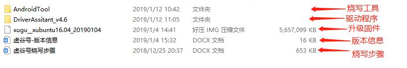

2.驱动安装

运行DriverAssitant_v4.6文件夹下的DriverInstall.exe程序。

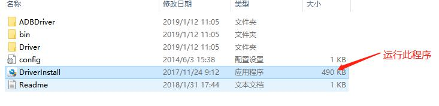

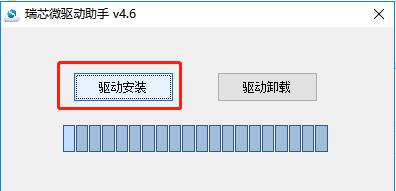

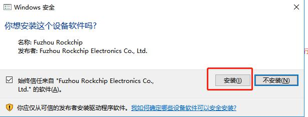

.. image:: ../images/03/system05.jpg

-------------------------
步骤详解
-------------------------

1.打开烧写程序

打开AndroidTool\AndroidTool_Release目录下的AndroidTool.exe

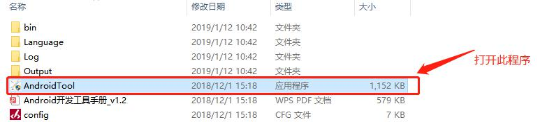

打开后如下所示：

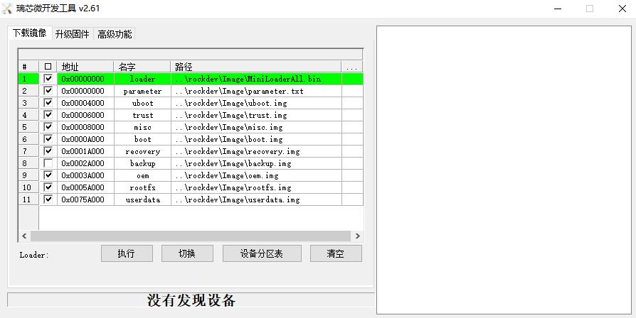

2.进入Loader模式

1）设备断开所有电源。
 
2）按住虚谷板的reset按键

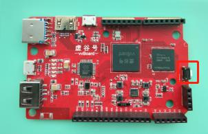

3）用 Micro USB OTG 线连接好设备和主机。

4）显示发现一个LOADER设备时，松开按键设备就进入 Loader 模式，进行烧写。

.. image:: ../images/03/system09.jpg

5）烧写

.. image:: ../images/03/system10.jpg

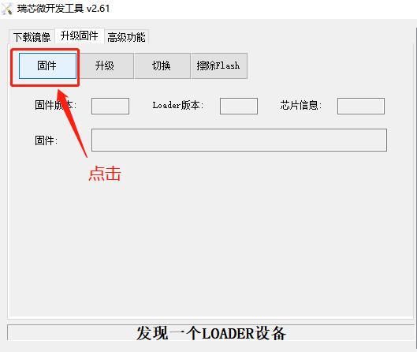

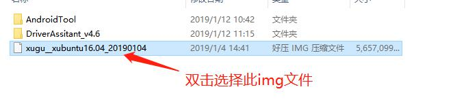

.. image:: ../images/03/system13.jpg

.. image:: ../images/03/system14.jpg

6）重启

固件烧写成功后，虚谷号将重新启动，这时候要**稍等数分钟**，等待系统更新完毕。等到vvBoard盘符出现后，系统升级成功！

**注意点：**
	-固件烧写成功后将重新启动，还要稍等数分钟才能正常使用。
	-部分板子（概率很小）可能需要完全断电，静置数分钟才能正常使用。

-----------------------------------------
固件升级失败原因及解决方法 
-----------------------------------------
 
固件升级失败一般分为两种情况。

一、没有找到设备。

按住RST键接入，固件升级工具中提示“没有找到设备”。这种情况一般是驱动没有正确安装引起。请重新安装。当按住RST键接入电脑，电脑的设备中将出现一个名为“Class for rockusb devices”的设备，如果设备上有感叹号，说明驱动没有正确安装。

二、固件升级显示升级失败，如下图所示。

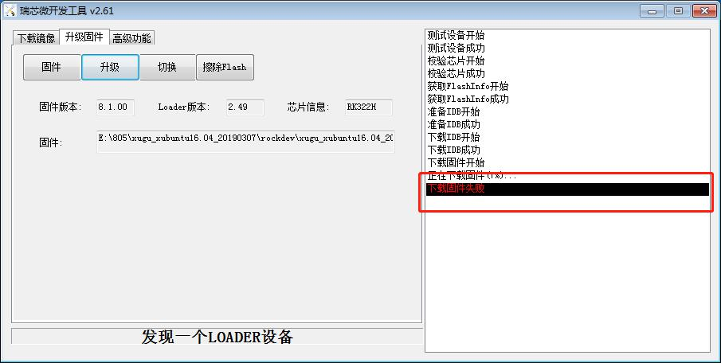

失败的原因及为以下几种：
  
A、升级过程中碰到USB连接线，导致接触不良。

B、使用笔记本电脑（旧版本）给板子供电，导致供电不足。
  
C、1+8（创客版）的板子升级2+32（教育版）的固件。

**注意**：如果提示设备测试失败，或者升级后不能进入U盘模式，都可以参考下面的办法！！！

解决方法：
  
A、供电不足：在进入loader模式后，在HDMI处再连接一根电源线，最好采用2A的充电器供电，如下图所示：

.. image:: ../images/03/system16.jpg

B、烧错固件：更改为正确的固件进行烧录（注：2+32（教育板）的板子可以烧录1+8的固件

C、重新拔插USB口烧写。

----------------------------
MaskRom模式详解
----------------------------

如果loader模式失败，动手能力强的用户可以试一下MaskRom模式。在打开烧写程序后，要做如下工作。

1.在虚谷板上找到对应的两点，如下图红框内所示：

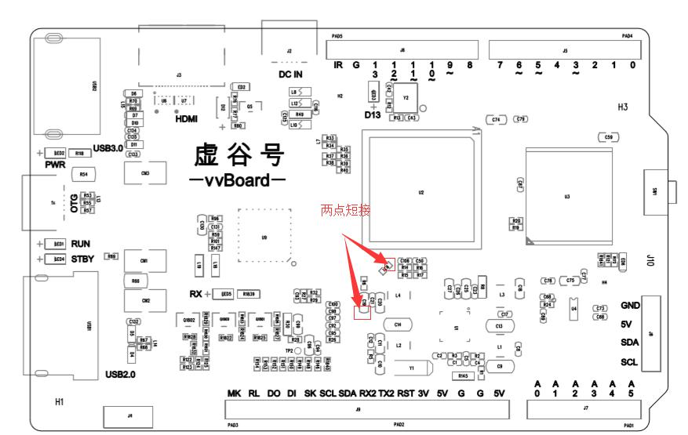
 
2.设备断开所有电源。

3.用金属镊子接通图片的两点，并保持。

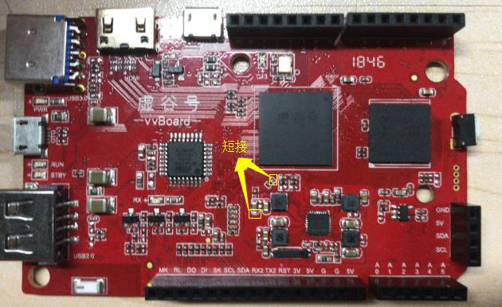

4.用Micro USB OTG线连接好设备和主机。

5.显示发现一个MaskRom设备时，松开镊子设备就进入MaskRom模式，进行烧写。

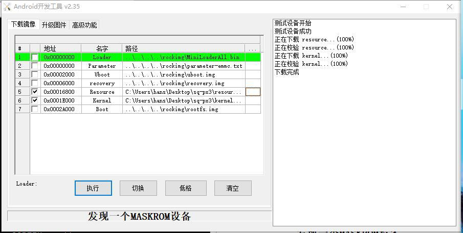

 
