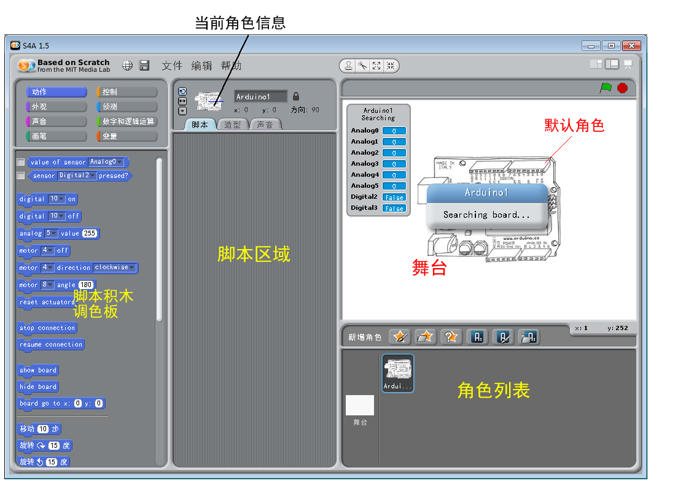

S4A
=============================

S4A介绍
---------------------
S4A是Scratch for Arduino的缩写,由西班牙的Citilab开发。它主要提供了对Arduino和Andriod的支持：采用Arduino作为传感器和执行器的控制平台，提供了6组模拟输入和2组数字输入接口，以及舵机输出和数字输出接口，具有强大的输入和输出的功能；提供了基于HTTP协议的远程传感器功能和安卓手机的配套程序，可以组网互动，也可以和智能手机进行互动。

虚谷号预装了S4A，只要给板载的Arduino写入一个特定固件，不用外加硬件，即可正常使用S4A的全部功能。

s4a的官方网站：http://s4a.cat/

----------------------
S4A的基本功能
----------------------

使用S4A之前，要先给板载的Arduino写入一个特定的Firmware（固件）。Firmware是要写入Arduino芯片中的程序，其实就是用Arduino IED编写的程序。S4A的开发团队在官方网站上提供Firmware下载，最新的版本是1.6。在虚谷号上的vvBoard目录中，就能找到这个固件文件。具体位置为：arduino -> 01.example -> 22.S4A。

固件下载地址：http://seaside.citilab.eu/

用Arduino的IDE打开固件，并且下载。成功后，请先关闭Arduino的IDE软件，再打开S4A（为了避免串口被占用，其他和串口相关的软件最好都关闭）。稍等片刻，看到S4A上的Arduino监视器上数字在快速变化，表示连接成功。

仔细观察S4A的监视器。你会发现一个奇特的现象：虽然没有接上传感器，但是数值还是在不断的变化。一旦接上了传感器，显示出来的数值就比较稳定了，不会毫无规律地在变化。

S4A提供了6组的模拟口和2组数字口作为传感器的输入口，指令块的功能说明如图所示。模拟传感器的值在0-1023之间，数字传感器的值为“ture”（成立）或者“false”（不成立）。

.. image:: ../images/05/s4a02.png

----------------------
S4A的作品范例
----------------------

1）传感器输入范例：“阳光牧场”

作品描述：默认显示一张美丽的牧场风景。当光线很暗的时候，牧场的景物也变得很暗；当光线变亮的时候，景物也随之变亮。
材料清单：光线传感器×1（Arduino板和扩展板为基本材料，所以就不包含在材料清单中了）。
连接说明：光线传感器接到扩展板的模拟口0（A0），放在能接受到光线变化的地方。实物连接图可以参考第3章的图3-28。
角色列表：默认角色（Arduino1），修改其造型为牧场图片，如下图所示。
 
.. image:: ../images/05/s4a03.png

参考脚本：脚本写在默认角色上，如下图所示。
 
.. image:: ../images/05/s4a04.png

作品点评：

因为S4A的模拟传感器的值在0-1023之间，DFRobot的光线传感器在室内的数值一般为500左右，光线越亮数值越小，所以先除以10，再用50进行相减，使角色的亮度效果处于-50到50之间。当然，因为不同光线传感器的数值也是不同的，具体的效果需要调试后，才能找到最准确的参数。这个作品虽然简单，却很能体现互动媒体的“互动”，运行效果如下图所示。

 
.. image:: ../images/05/s4a05.png

作品优化：

如果再制作几个小动物在牧场上生活，光线亮就自由运动着，并不时发出叫声（要使用随机数哦）。当光线一暗，就隐藏起来，不发出声音。那么，这个简单的互动作品也就有趣起来了。

