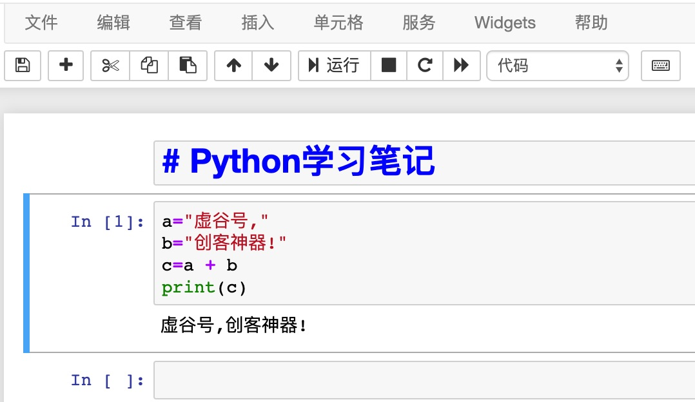

Jupyter
===========================

Jupyter的全称为Jupyter Notebook（此前被称为IPython notebook），是一个交互式笔记本，支持运行40多种编程语言。通过Jupyter，可以通过Web页面在虚谷号上运行Python代码和Linux命令。

Jupyter的本质是一个Web应用程序，便于创建和共享程序文档，支持实时代码，数学方程，可视化和markdown。很多人喜欢直接在Jupyter上写代码，并同步记录学习心得，这样的学习笔记实际上就是一个很好的教程。

------------------------
Jupyter快速入门
------------------------

步骤1:访问Jupyter

虚谷号提供了多种方式访问Jupyter：
	- 在浏览器直接输入http://【虚谷号IP】:8888。
	- 打开U盘中vvBoard文件夹，如果虚谷号连上Wi-Fi，该文件夹将出现“访问Jupyter”的快捷方式。

虚谷号上的Jupyter默认密码为“scope”。

**注**：请使用谷歌浏览器（或者使用谷歌浏览器内核的浏览器）访问Jupyter。虚谷号的Wi-Fi有记忆功能，一般来说IP地址是不会变化的。当Wi-Fi信息设置好后，只要提供电源和Wi-Fi信号，就能使用Jupyter来访问虚谷号。

.. image:: ../images/02/wifi03.jpg

步骤2:运行Linux命令

.. image:: ../images/02/wifi07.jpg

在仿真的终端页面，Jupyter几乎支持所有的命令，如安装软件、安装Python库文件、运行Python程序等。当关闭窗口后，再次打开，还能够看到之前的命令运行状态。

通过终端页面，还能够看到一共有几个命令窗口在运行。在不同电脑登陆Jupyter，可以共享这一界面。（用于教学非常合适）

步骤3:浏览Jupyter笔记

虚谷号上提供了一些学习笔记，默认放在vvBoardbook文件夹中。

.. image:: ../images/02/2-07.jpg

在网上能够找到很多jupyter学习笔记（扩展名为ipynb），如jupyter的官方网站。（https://nbviewer.jupyter.org/）

这些学习笔记中，一般既有用MarkDown语法编写的文字，也有代码。其中代码的左边有“in [ ]”的标识。

用鼠标激活代码输入框（出现蓝色或者绿色边框），在菜单中选择“执行”命令，代码输入框的下方，将出现代码执行效果。执行完毕后，“in [ ]”中的括号将出现一个数字，表示这段代码运行的次序。

步骤4:新建Jupyter笔记

.. image:: ../images/02/wifi05.jpg

Jupyter的笔记内容主要分为两种类型，一种是代码，另一种是文本。代码带有“in [ ]”的标识，支持Python、命令行。文本支持MarkDown语法。

------------------------------
Jupyter的代码调试技巧
------------------------------

1.如何快速运行指定的代码？

	- 运行所有单元格
	- 运行所有
	- 运行上面的代码块
	- 运行下面的代码块

2.如何重新启动笔记？

	- 重启
	- 重启 & 清空输入
	- 重启 & 运行所有

3.如何在下次打开处于代码未运行状态？

关闭笔记前，执行“重启 & 清空输入”，然后保存退出。

------------------------------
如何用Jupyter写笔记
------------------------------

Jupyter的笔记中既可以插入代码，也可以用MarkDown语法排版的文字。

MarkDown教程：https://baike.baidu.com/item/markdown/3245829?fr=aladdin

Jupyter支持用“CTRL+C”的形式插入图片。

------------------------------
虚谷号内置Jupyter教程
------------------------------

为了帮助虚谷号用户快速掌握Python编程，虚谷计划团队编写了一系列教程。

1.在网页上画画（谢作如）

	- 在网页上，用命令来画各种图形。记着LOGO语言吗？这是一个简化版本。边输代码边画画，很直观，效果也很酷。

	.. image:: ../images/05/5.4-kc-002.png

2.Python快速入门（张路、谢作如）

	- 课程的另一个名称是：Python入门教程——用编程的方式让计算机做算术

	.. image:: ../images/05/5.4-kc-001.png

3.虚谷号GPIO

4.百度人工智能

5.控制你的小米灯泡（谢作如、林淼焱）

	- 在虚谷号上编程控制小米灯泡（Yeelight灯泡，价格99元）。

6. ……

------------------------
Jupyter的高级应用
------------------------

1.如何在笔记中插入Linux系统命令？

2.如何导出Jupyter笔记？

------------------------------
Jupyter的扩展插件
------------------------------

很多人为Jupyter开发了各种扩展插件，包括支持更多的编程语言、笔记样式等。安装扩展最好的方法是Jupyter NbExtensions Configurator，它提供了一系列标签，只需勾选相应插件就能自动载入。

1.NbExtensions Configurator

用conda安装：

	- conda install -c conda-forge jupyter_contrib_nbextensions

	- conda install -c conda-forge jupyter_nbextensions_configurator

或者用pip：

	- pip install jupyter_nbextensions_configurator jupyter_contrib_nbextensions

	- jupyter contrib nbextension install --user

	- jupyter nbextensions_configurator enable --user

2.Collapsible headings

这个扩展在大型Notebook中非常有用，可折叠的标题能帮你收起/放下Notebook中的某些内容，使整个页面看起来更干净整洁。

.. image:: ../images/05/5.4-c-h.gif

3.Code folding

在Jupyter Notebook中，你能折叠的不只有标题，还有代码。

.. image:: ../images/05/5.4-c-f.gif

4.Processing

通过插件，Jupyter还支持Processing、C等。

