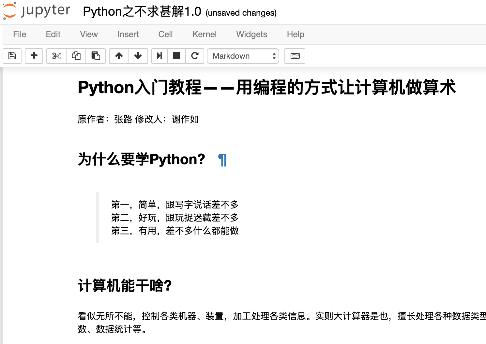
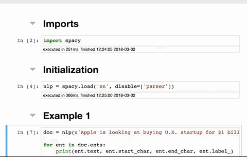

Jupyter
===========================

Jupyter的全称为Jupyter Notebook（此前被称为IPython notebook），是一个交互式笔记本，支持运行40多种编程语言。

Jupyter的本质是一个Web应用程序，便于创建和共享程序文档，支持实时代码，数学方程，可视化和markdown。很多人喜欢直接在Jupyter上写代码，并同步记录学习心得，这样的学习笔记实际上就是一个很好的教程。

通过Jupyter，可以通过Web页面在虚谷号上运行Python代码和Linux命令。

------------------------
Jupyter快速入门
------------------------

步骤1:访问Jupyter

在浏览器输入http://【虚谷号IP】:8888，即可打开一个页面，输入密码scope。

【截图】

步骤2:运行Linux命令

【截图】

步骤3:新建Jupyter笔记

【截图】

------------------------------
如何用Jupyter写笔记
------------------------------

Jupyter的笔记中，可以插入代码，也可以用Makedown语法排版。

------------------------------
虚谷号内置Jupyter教程
------------------------------

为了帮助虚谷号用户快速掌握Python编程，虚谷计划团队编写了一系列教程。

1.在网页上画画（谢作如）

	- 在网页上，用命令来画各种图形。记着LOGO语言吗？这是一个简化版本。边输代码边画画，很直观，效果也很酷。

.. image:: ../images/05/5.4-kc-002.png

2.控制你的小米灯泡（谢作如、林淼焱）

	- 在虚谷号上编程控制小米灯泡（Yeelight灯泡，99元）。

3.Python之不求甚解（张路、谢作如）

	- 课程的另一个名称是：Python入门教程——用编程的方式让计算机做算术

4.……

------------------------
Jupyter的高级应用
------------------------

1.如何在笔记中插入Linux系统命令？

2.如何导出笔记？

------------------------------
Jupyter的扩展插件
------------------------------

很多人为Jupyter开发了各种扩展插件，包括支持更多的编程语言、笔记样式等。安装扩展最好的方法是Jupyter NbExtensions Configurator，它提供了一系列标签，只需勾选相应插件就能自动载入。

1.NbExtensions Configurator

用conda安装：

	- conda install -c conda-forge jupyter_contrib_nbextensions

	- conda install -c conda-forge jupyter_nbextensions_configurator

或者用pip：

	- pip install jupyter_nbextensions_configurator jupyter_contrib_nbextensions

	- jupyter contrib nbextension install --user

	- jupyter nbextensions_configurator enable --user

2.Collapsible headings

这个扩展在大型Notebook中非常有用，可折叠的标题能帮你收起/放下Notebook中的某些内容，使整个页面看起来更干净整洁。

3.Code folding

在Jupyter Notebook中，你能折叠的不只有标题，还有代码。

.. image:: ../images/05/5.4-c-f.gif

