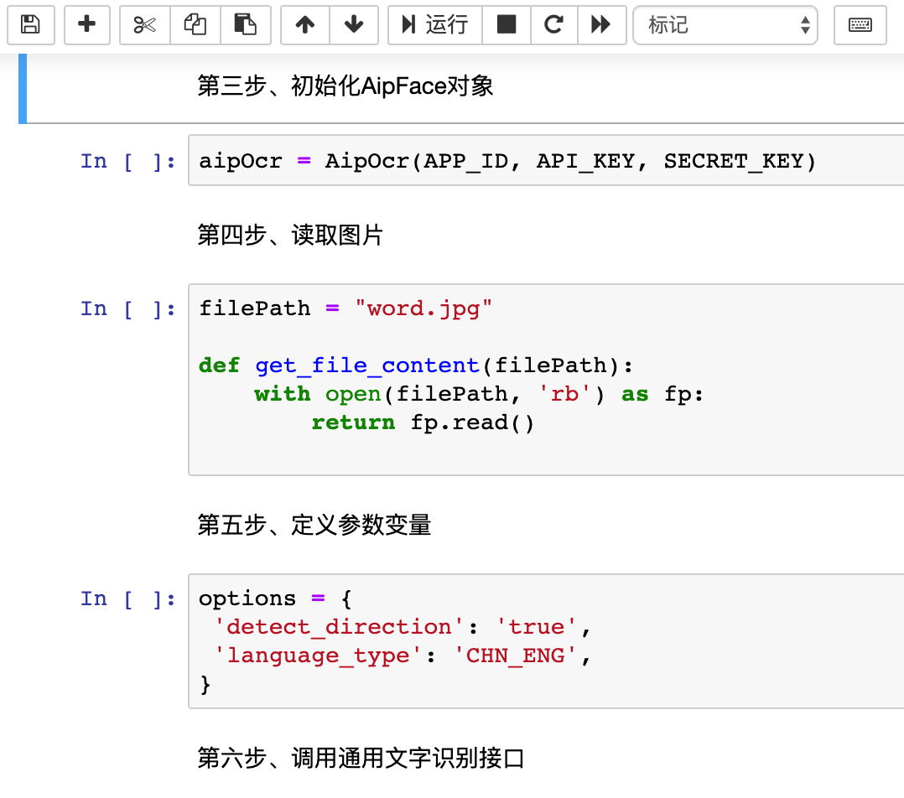
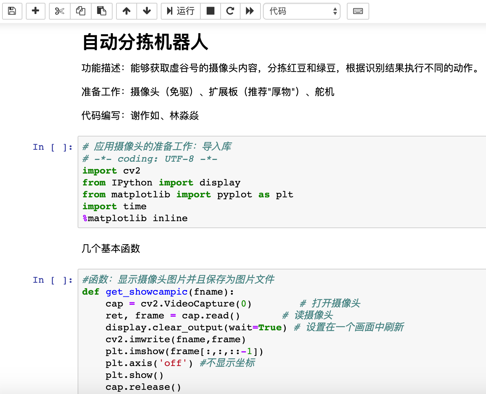
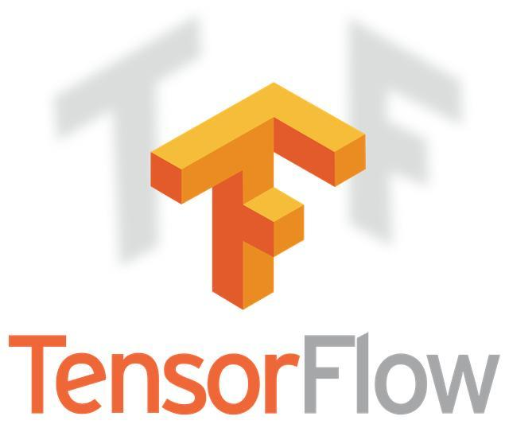

虚谷号和人工智能
===============================

虚谷号可以用于中小学的人工智能教育。传统的开源硬件如Arduino、micro:bit、掌控板要加入人工智能的元素，一般得借助于其他的硬件或者电脑。一些厂商因此开发了类似网络模块、智能摄像头和语音识别卡之类的硬件。而虚谷号是一个完整电脑，具备强大的算力，可以直接处理视频和音频数据。我们可以把虚谷号看成是“集成网络和算力的Arduino”。

虚谷号内置了相关的人工智能课程，供初学者快速上手。

---------------
百度AI
---------------

虚谷号安装了百度AI的Python库，可以很方便地调用百度AI开放平台的各种应用，如语音识别、文字识别、智能对话、语音合成、人脸识别、图像识别等。

在虚谷号内置的课程中，提供了一系列的基于百度AI的编程笔记。

.. image:: ../images/06/6.1-ai01.png

---------------
计算机视觉
---------------

计算机视觉是一门研究如何使机器“看”的科学，更进一步的说，就是是指用摄影机和电脑代替人眼对目标进行识别、跟踪和测量等机器视觉，并进一步做图形处理，使电脑处理成为更适合人眼观察或传送给仪器检测的图像。作为一个科学学科，计算机视觉研究相关的理论和技术，试图建立能够从图像或者多维数据中获取‘信息’的人工智能系统。因为感知可以看作是从感官信号中提取信息，所以计算机视觉也可以看作是研究如何使人工系统从图像或多维数据中“感知”的科学。

虚谷号采用最通用的USB摄像头作为视觉采集设备，借助OpneCV、face_recognition等软件，可以让学生快速进入计算机视觉的学习领域。

1.OpenCV库

OpenCV（Open Source Computer Vision Library）是一个开源BSD库，该库包括数百个机器视觉算法。它轻量级而且高效——由一系列 C 函数和少量 C++ 类构成，同时提供了Python、Ruby、MATLAB等语言的接口，实现了图像处理和计算机视觉方面的很多通用算法。

OpenCV库的官方地址: http://opencv.org

2.face_recognition库

face_recognition是一个强大、简单、易上手的人脸识别开源项目，并且配备了完整的开发文档和应用案例，特别是兼容树莓派、虚谷号之类的迷你电脑系统。

face_recognition的中文文档：
https://github.com/ageitgey/face_recognition/

3.虚谷号固件中的“视觉识别”相关课程

.. image:: ../images/06/6.1-ai03.png

----------------
机器学习
----------------

机器学习(Machine Learning, ML)是一门多领域交叉学科，涉及概率论、统计学、逼近论、凸分析、算法复杂度理论等多门学科。专门研究计算机怎样模拟或实现人类的学习行为，以获取新的知识或技能，重新组织已有的知识结构使之不断改善自身的性能。它是人工智能的核心，是使计算机具有智能的根本途径，其应用遍及人工智能的各个领域，它主要使用归纳、综合而不是演绎。

虚谷号（目前仅教育版）预装了Scikit-Learn、TensorFlow和Keras等机器学习方面的主流框架。

1.Scikit-Learn

Scikit-Learn为了数学和科学工作，基于现有的几个Python包(Numpy，SciPy和matplotlib)拓展了Python的使用范围。最终生成的库既可用于交互式工作台应用程序，也可嵌入到其他软件中进行复用。该工具包基于BSD协议，是完全免费开源的，可重复利用。Scikit-Learn中含有多种用于机器学习任务的工具，如聚类，分类，回归等。

Scikit-learn是在另外三个开源项目Matplotlib，NumPy和SciPy上设计的，它专注于数据挖掘和数据分析。

.. image:: ../images/06/6.1-scikit-learn.jpg

2.TensorFlow

TensorFlow最初于2015年发布，是一款开源机器学习框架，易于在各种平台上使用和部署。TensorFlow使用数据流图进行数值运算，张量(“tensors”)可由一系列图形描述的算法来处理，数据在该系统中的变化被称为“流”，因此得名。TensorFlow可用于Python，C ++，Haskell，Java，Go，Rust以及Java等，是机器学习中维护得最好和广泛使用的框架之一。

3.Keras

Keras是一个开源软件库，最初于2015年发布，旨在简化深度学习模型的创建。它用Python编写，可以部署在其他人工智能技术之上，如TensorFlow，微软Cognitive Toolkit（CNTK）和Theano。

.. image:: ../images/06/6.1-keras.jpg

4.虚谷号内置的“机器学习”相关课程

.. image:: ../images/06/6.1-ai05.png

.. image:: ../images/06/6.1-ai06.png

---------------------------------------
借助虚谷号学习AI的几种途径
---------------------------------------

1.快速体验：利用虚谷号自带的AI模块

利用虚谷号的算力，可以直接运行一些简单的模型训练，如广告预测、鸢尾花分类、手写数字识别等。因为虚谷号已经内置所有必要的环境，用户只要打开虚谷号的jupyter就能学习，快速上手。

具体请参考“1-广告预测-Advertising.ipynb”、“2-鸢尾花分类-Iris.ipynb”、“3-手写体数字识别-Mnist.ipynb”等。

2.应用转移：将AI的模型移植到虚谷号

一些数据量较大的模型训练，如古诗词生成器（循环神经网络）、图像聚类（卷积神经网络），直接在虚谷号上训练，速度比较慢。建议利用专用的GPU设备进行训练，然后将模型部署到虚谷号上。

具体请参考“4-图像聚类-cifar10.ipynb”、“8-古诗生成器_训练版.ipynb”这两个课程。

3.巧借外力：利用专用的算力扩展设备

虚谷号支持外置的算力扩展设备，如intel的人工智能计算棒。借助计算棒，虚谷号的AI性能将得到大幅度的提升。

