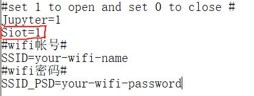
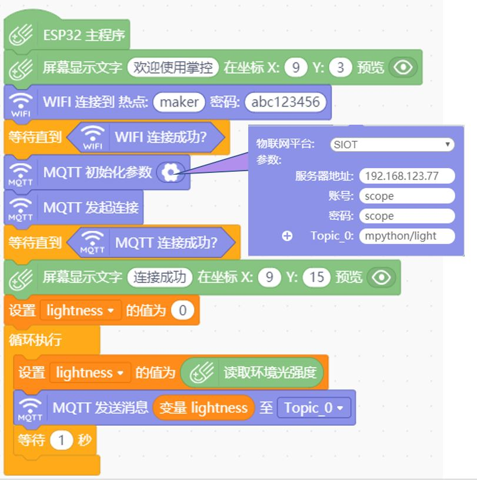
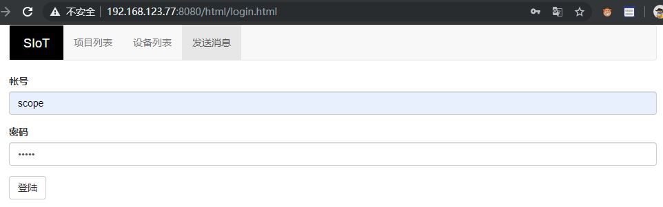
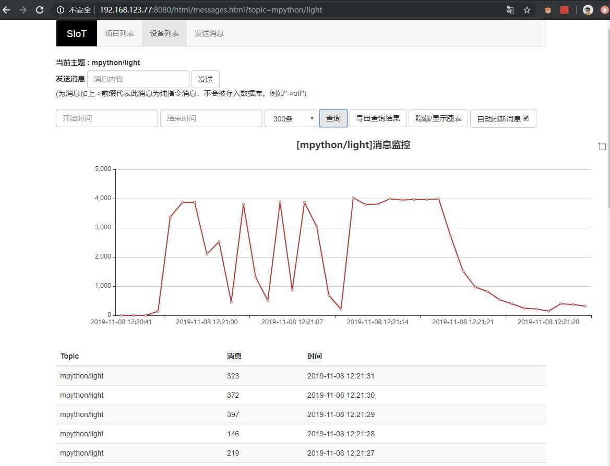

虚谷号和物联网
==============================

虚谷号作为一个全功能的迷你电脑，在物联网应用方面即可以作为服务器，也可以作为客户端。

MQTT是物联网中最常用的一种协议，越来越受到行业的关注。虚谷号默认安装了基于MQTT的开源服务器SIoT，使其在变得更加方便。

-----------------------------
SIoT和虚谷物联项目
-----------------------------

SIoT为一个为教育定制的跨平台的MQTT服务器程序，S指科学（science）、简单（simple）的意思。SIoT支持Win10、Win7、Mac、Linux等操作系统，一键启动，无需注册即可使用。SIoT的所有物联网消息可以根据需要导出为各种格式，用于后期分析。尤其是用于科学数据采集。

SIoT的最大特点是使用简单。软件运行后，不需要任何设置就可以使用。利用特定的“Topic”的名称（“项目名称/设备名称”），就能自动在数据库中添加项目和设备的名称，并将消息数据存入数据库。

SIoT为“虚谷物联”项目的核心软件，和虚谷号一样，都是“虚谷计划”旗下的项目。对于中小学教学而言，选择用虚谷号结合SIoT作为物联网服务器，掌控板（“虚谷计划”旗下的另一款开源硬件）作为物联网终端，可谓珠联璧合。

- 您可以访问SIoT使用手册文档：https://siot.readthedocs.io/zh_CN/latest/ 了解更多关于SIoT的使用方式。

.. image:: ../images/06/iot01.png

---------------------------------
虚谷号作为MQTT服务器
---------------------------------
这很容易，只要给虚谷号供电，接入局域网即可。具体操作如下。

使用U盘模式将虚谷号连接至电脑，配置vvBoard_config.ini如下图所示，其中Siot=1表示开启SIoT，0表示关闭SIoT。下面的Wi-Fi配置根据自己的情况配置即可。配置好之后，短按RST键，U盘短暂消失，再次连接时，打开wifi_log.txt即可查看虚谷号IP地址。假设IP地址为xxx.xxx.xxx.xxx，则SIoT服务器地址为xxx.xxx.xxx.xxx:8080，可以使用其他任何MQTT客户端连接。

.. image:: ../images/06/6.2_ip.JPG

下面以掌控板连接为例介绍SIoT的使用。

使用Mind+给掌控板编程十分便捷。选择正确的主控板和组件后，编程就像搭积木一样。这里以测量环境光强度为例，组件拼接如下图所示。

电脑连接掌控板后上传代码便可以运行了。这时的虚谷号和掌控板均只要接通电源即可工作，不再需要连接电脑。

.. image:: ../images/06/？

通过浏览器访问SIoT服务器（在浏览器输入IP地址+“:8080”访问），可以看到掌控板向搭载在虚谷号上的SIoT发送的消息。

默认登录账号和密码均是scope。

点击上方的设备列表，可以看到我项目ID为mpython，名称为light的设备，也可以根据自己的需求做相应修改。

.. image:: ../images/06/6.2_devices.JPG

点击查看消息，可以看到具体的消息。本页面还具有导出查询结果（Excel表格），显示/隐藏图表，自动刷新消息等功能。也可以通过发送消息与设备通信。

---------------------------------
虚谷号作为MQTT客户端
---------------------------------
需要先安装python库：siot。安装命令是 sudo pip install siot ，如果已经安装，就不需要再执行这一步。

使用python语言为虚谷号编程，内容如下：

上传代码的方式有很多，这里介绍通过U盘模式上传给虚谷号。

将写好的代码复制到python文件夹下，修改配置如图所示。短按RST键，U盘消失片刻再次出现，这时python代码就已经在运行了。可以登录SIoT服务器查看消息，也可以通过其他MQTT客户端订阅该消息。

---------------------------
应用案例
---------------------------

1.手机远程控制虚谷号

2.科学观察助手

