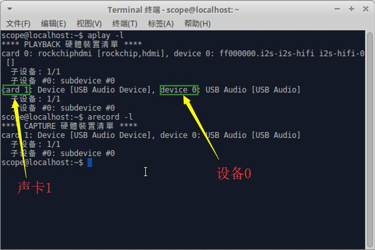
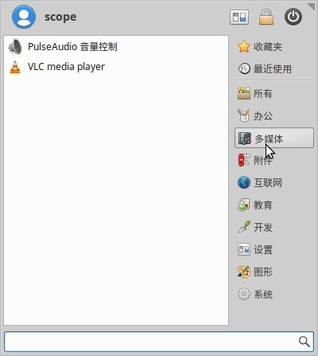
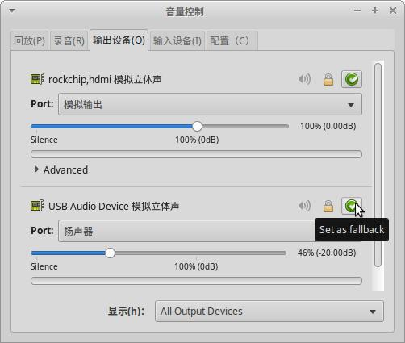
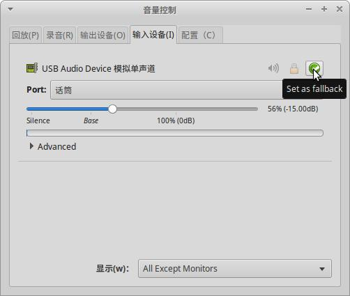

音频设备
================

虚谷号接上声卡后，可以接麦克风和音箱等音频设备，成为一台多媒体电脑。建议选择内置声卡的麦克风（很多摄像头都已经内置麦克风）和内置声卡的小音箱。

注意：如果虚谷号接了无源音箱，需要在电源口另外接上2A的电源，才能确保供电正常。否则可能导致音箱不能正常使用。

---------------------------------
声卡推荐
---------------------------------

vvBoard支持绝大多数的免驱动USB声卡，大部分声卡即插即用，无需配置。

USB免驱声卡购买地址：

https://detail.tmall.com/item.htm?id=564470736512&price=29.9-39.9&sourceType=item&sourceType=item&suid

---------------------------------
内置麦克风的摄像头推荐
---------------------------------

大部分内置声卡即插即用，无需配置，具体见摄像头部分。

---------------------------------
内置声卡的小音箱推荐
---------------------------------

大部分内置声卡的小音箱即插即用，无需配置。

内置声卡的小音箱购买地址：

卡农（iKANOO）N12USB声卡驱动电脑音响
https://item.jd.com/30031188925.html

-----------------------------------
手动配置声卡步骤
-----------------------------------

1、终端运行aplay -l和arecord -l查看播放和录音的设备,如下图所示：

2、根据设备的声卡号和设备号修改当前目录下的asound.conf文件后保存，文件内容如下：

::

	defaults.pcm.card 1
	defaults.pcm.device 0
	defaults.ctl.card 1

3、终端输入：sudo cp asound.conf /etc ，将asound.conf文件复制到系统etc目录下。

4、点击桌面左下角开始图标，进入开始菜单；点击多媒体，找到 PulseAudio音量控制程序，如下图所示：

5、点击打开 PulseAudio音量控制程序，点击打开输出设备界面，找到USB Audio Device 设备单击对应名称后面的按钮，如下图所示：

6、点击打开输入设备界面，找到USB Audio Device 设备单击对应名称后面的按钮，如下图所示：

7、完成以上6步，默认声卡添加完毕。

