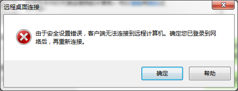
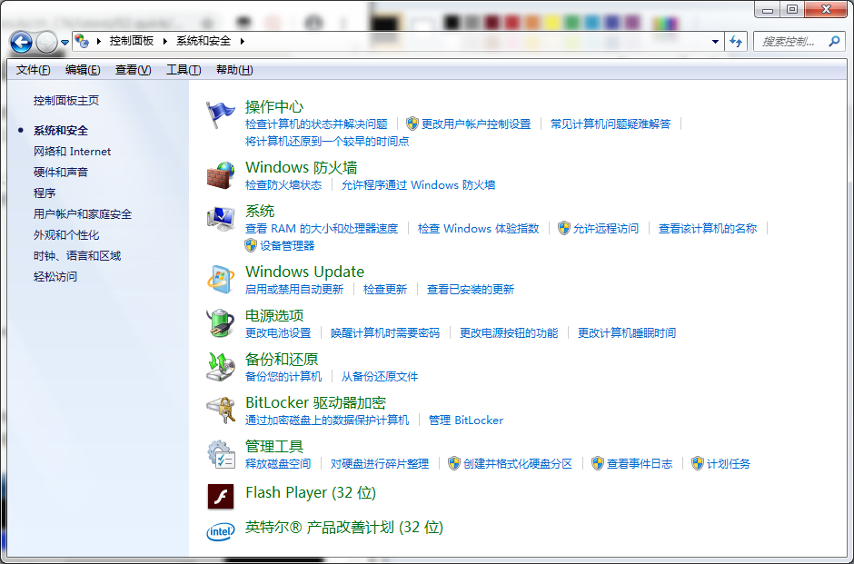
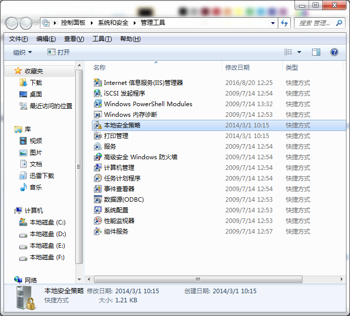
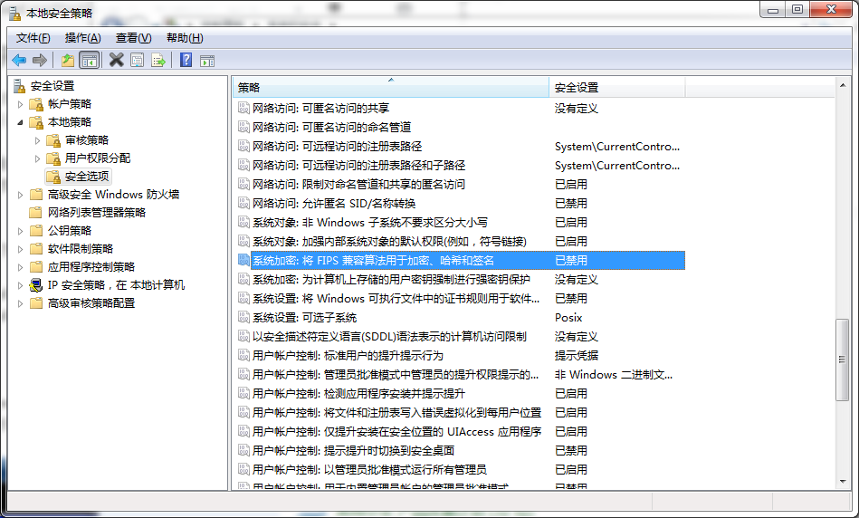

常见故障解答
==============================

虚谷号可以长时间稳定工作，并支持绝大多数能运行在ubuntu上的软硬件。因为虚谷号需要运行在2.0A以上的供电环境中，如果供电不足，可能会出现固件刷写失败，网络连接不稳定，U盘功能不能正常使用等问题。在排除故障之前，请**务必确保2A以上的供电**，再逐一排除。

-------------------
U盘模式诊断
-------------------

1.虚谷号接到电脑上没有出现U盘图标。

虚谷号通过OTG口接到电脑后，一般在15秒左右启动完成。电脑将发现一个新存储设备（类似U盘）。

	- 确认连接电脑的是否OTG口。
	- 确认数据线是否正常，请使用原装的数据线。
	- 通电后，试着按一次RST键。
	- 在电脑中查找磁盘，是否因为系统没有分配盘符引起。
	- 关闭360之类的电脑防护软件。
	- 确认供电是否不足，可以在电源口另外再接一条线供电。

2.按下RST程序没有执行。

在U盘模式下，虚谷号的RST键有如下几个作用，并且按照如下次序执行：

	1） 停止U盘服务；
	2） 如果Arduino文件夹有对应的ino文件，则编译并烧录ino文件；
	3） 如果Python文件夹有对应的main.py文件，则将main.py文件复制到特定文件夹下运行，并返回运行信息；
	4） 连接Wi-Fi，如果已经连接Wi-Fi，则重新连接Wi-Fi，重启jupyter服务。
	5） 启动U盘服务。

如果没有执行，请按照次序逐一排除，并且确认几点：

	- 确认接电脑的是OTG口；
	- 在电源口再接上使用充电宝（2A输出）或者2A以上的电源。

3.误删了U盘中的系统文件。

请将U盘中的文件全部删除或者格式化，断电再重新接上电脑，U盘中的文件将全部初始化。**注意：如果U盘中有其他重要文件，要及时备份！！！**

---------------------
Wi-Fi模式诊断
---------------------

1.设置Wi-Fi信息后，没有连上Wi-Fi。

通过U盘功能，在vvBoard_config.ini文件设置好SSID和密码后，按下RST键即可联网，如果没有联网，请检查如下几点：

	- 虚谷号目前只能支持2.4G频段的wifi网络，请确保提供的Wi-Fi信息是2.4G频段的。
	- SSID和密码中没有包含特殊字符。
	- 在电源口再接上使用充电宝（2A输出）或者2A以上的电源。

联网成功后，在vvBoard文件夹中将出现两个快捷方式。

2.无线模式下，用远程桌面连接虚谷号失败。

默认情况下，Win7系统连接虚谷号远程桌面会失败。连接失败提示内容：由于安全设置错误，客户端无法连接到远程计算机。确定您已经登录到网络中，再重新连接。（如图所示）

解决方案：禁用“本地安全策略”之“系统加密：将FIPS兼容算法用于加密、哈希和签名”项。

操作步骤：

（1）打开“控制面板”

.. image:: ../images/08/8.1-troubleshooting02.png

（2）打开“系统安全”

（3）打开“管理工具”

（4）打开“本地安全策略”

（5）找到“本地策略/安全选项/系统加密：将FIPS兼容算法用于加密、哈希和签名”，在属性中禁用“本地安全设置”

.. image:: ../images/08/8.1-troubleshooting06.png

----------------------
主机连接诊断
----------------------

1.接上HDMI线，显示器不亮。

需要确认以下几点：

	- 检查供电是否正常，请在电源口再接上使用充电宝（2A输出）或者2A以上的电源。
	- 检查HDMI线是否良好。
	- 检查虚谷号标注RUN的led灯是否有点亮，如led没有点亮请看启动诊断。

2.发现U盘中的文件全部加上了“锁”。

为了确保U盘文件系统稳定，虚谷号采用了一种保护机制。在主机模式时，OTG口接上电脑或者电源，U盘中的文件会全部锁定。OTG口断开后，文件自动恢复正常。

----------------
其他问题
----------------

1.RST键有什么作用？

虚谷号的RST键，相当于iphone的HOME键，发挥重要作用，除了刷固件时需要外。

2.如何区分创客版和教育版？

虚谷号的序列号第6位，创客版是1，教育版是2。

