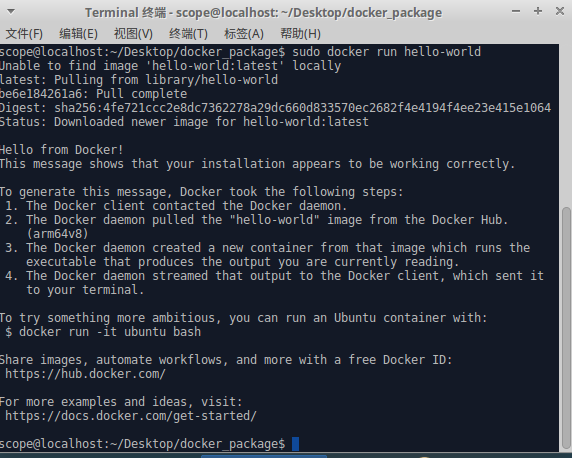


虚谷号和Docker
========================================

Docker是一个开源的应用容器引擎，在虚谷号上可以安装Docker。

----------------------
Docker简介
----------------------

Docker是一个开源的应用容器引擎，让开发者可以打包他们的应用以及依赖包到一个可移植的镜像中，然后发布到任何流行的 Linux或Windows机器上，也可以实现虚拟化。容器是完全使用沙箱机制，相互之间不会有任何接口。

由于运行Docker需要较大的内存和存储空间，虚谷号的创客版默认没有安装Docker。

-----------------------------
Docker的安装
-----------------------------
安装docker有两种方法，一种是使用存储库安装，一种是使用安装包安装

一、使用存储库安装的步骤：

1）升级更新apt包，打开终端输入：sudo apt-get update

2）安装软件包，允许apt通过HTTPS使用存储，终端输入：sudo apt-get install apt-transport-https ca-certificates curl gnupg-agent software-properties-common

3）添加docker的官方GPG密钥，终端输入：curl -fsSL https://download.docker.com/linux/ubuntu/gpg | sudo apt-key add -

4）设置稳定的存储库，终端输入：sudo add-apt-repository "deb [arch=arm64] https://download.docker.com/linux/ubuntu $(lsb_release -cs) stable"

5）更新apt包，终端输入:sudo apt-get update
          
6）安装最新版本的docker engine-community和containerd，终端输入：sudo apt-get install docker-ce docker-ce-cli containerd.io
         
7）至此，docker已经安装上，并且默认打开
    
二、使用安装包安装的步骤：

1）使用自己的电脑下载安装包docker_package.tar.gz，下载链接：https://pan.baidu.com/s/1MdAIQxuTE_HykRMaPTXoBw

2）将安装包移到虚谷号桌面，右击选择“在此解压”。
    
3）进入文件夹，右击空白处，选择“Open Terminal Here”输入命令:sudo apt-get install libseccomp2

4）继续输入命令：sudo dpkg -i containerd.io_1.2.10-3_arm64.deb docker-ce-cli_19.03.5_3-0_ubuntu-xenial_arm64.deb docker-ce_19.03.5_3-0_ubuntu-xenial_arm64.deb
          
-----------------------------
Docker的验证
-----------------------------
打开终端，输入：sudo docker run hello-world，结果如下：

