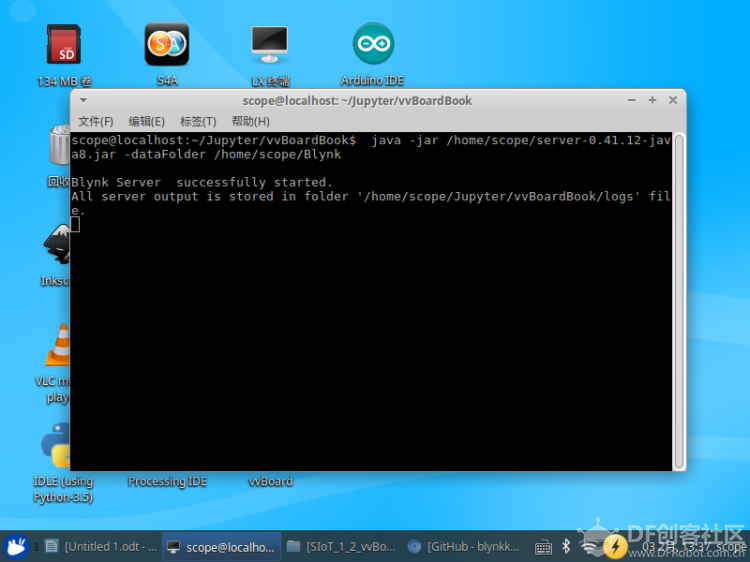
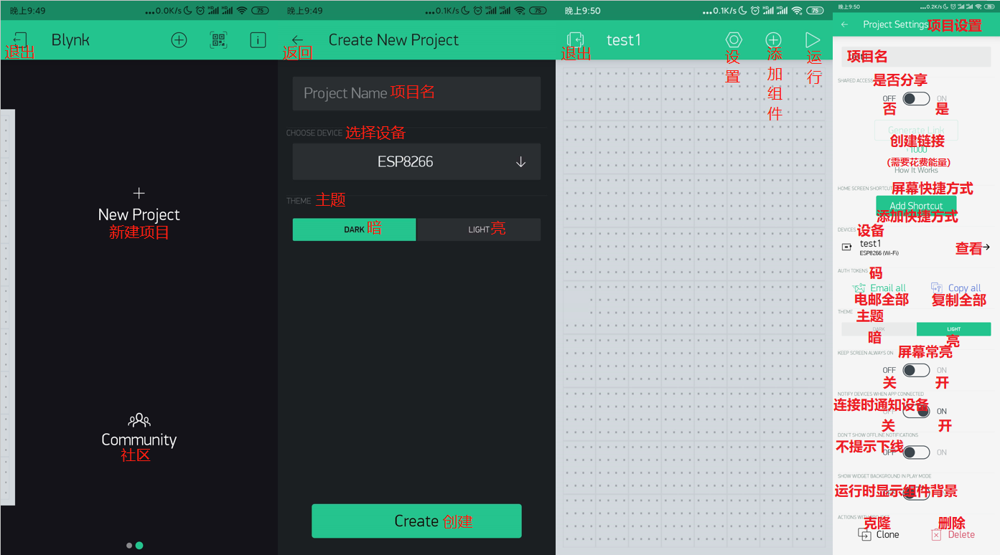
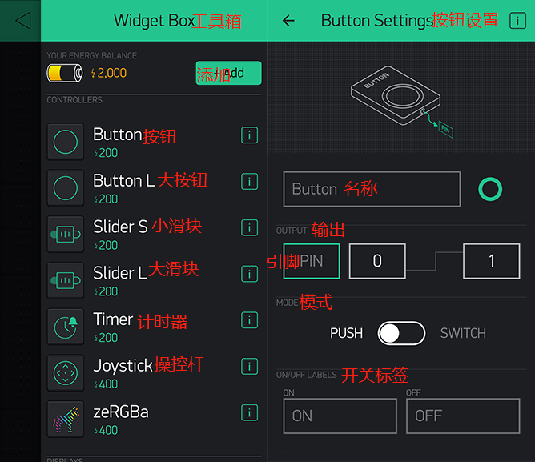
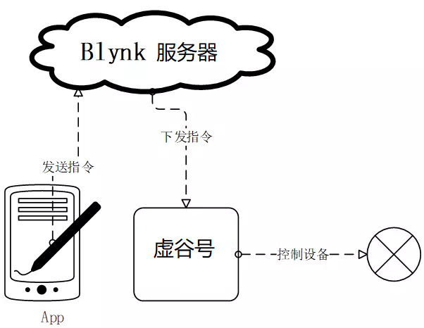
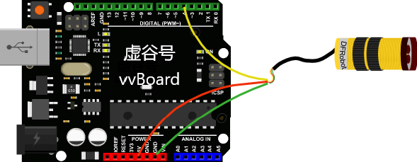
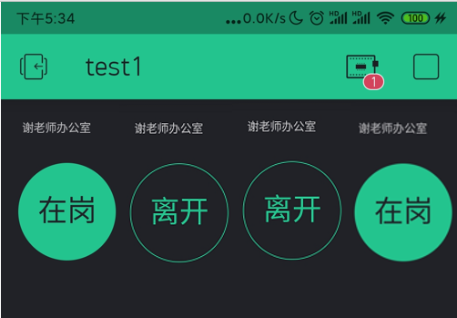

Blynk本地服务器的部署
========================================

Blynk是一个物联网平台，旨在简化物联网的移动和Web应用程序的构建。虚谷号上已经整合了SIoT，但是Blynk也可以同时部署。

----------------------
Blynk简介
----------------------

Blynk的App是具有易于使用的拖放系统，可为IoT设置构建自定义控件。工作流程非常快速：启动新项目时，系统会提示您从广泛的列表中选择开发板，以及连接方式。然后，该应用通过电子邮件发送授权令牌，以通过Blynk服务器连接到您的设备。应用中的提供了很多小部件。每个小部件都有一个编辑菜单，可让您更改名称和颜色。然后，您选择要影响的引脚（无论是板上的引脚还是Blynk的虚拟引脚之一）以及要发送的值范围。对于图形或文本框之类的输出显示，您还可以选择更新频率，从而节省宝贵的带宽。Blynk还具有将指令分配给“虚拟”引脚的功能，这是用户配置的应用程序与硬件之间的连接。因此，应用程序中的单个按钮可用于触发设备上的许多不同事件。

相对于其他MQTT的服务器来说，Blynk的优势在于连接快速，且提供了免费的移动平台上的配套应用，包括iOS和Android。

Blynk项目分为三个部分：

**1.Blynk应用（App）**

Blynk的App是具有易于使用的拖放系统，可为IoT设置构建自定义控件。工作流程非常快速：启动新项目时，系统会提示您从广泛的列表中选择开发板，以及连接方式。然后，该应用通过电子邮件发送授权令牌，以通过Blynk服务器连接到您的设备。

.. image:: ../images/08/8.7-ad.png

应用中的提供了很多小部件。每个小部件都有一个编辑菜单，可让您更改名称和颜色。然后，您选择要影响的引脚（无论是板上的引脚还是Blynk的虚拟引脚之一）以及要发送的值范围。对于图形或文本框之类的输出显示，您还可以选择更新频率，从而节省宝贵的带宽。

Blynk还具有将指令分配给“虚拟”引脚的功能，这是用户配置的应用程序与硬件之间的连接。因此，应用程序中的单个按钮可用于触发设备上的许多不同事件。

**2.Blynk服务器**

创建了用于控制设备的应用后，您可以有两种方法与之通信。

第一选择是用Blynk云服务器。这个服务器快速，响应迅速且免费使用。连接到Wi-Fi设备就像将生成的授权代码复制到Arduino草图中并提供Wi-Fi详细信息一样容易。

第二个选择是自己部署Blynk服务器。 Blynk提供了一个基于Netty的开源Java服务器，可以从您的计算机甚至Raspberry Pi、虚谷号(vvboard)、拿铁熊猫(LattePanda)之类的迷你电脑来运行该服务器。在功能和安全性方面，这为某些用户带来了各种好处。

这里我们当然选择第二种方式。

**3.Blynk库**

Blynk提供了完善的Blynk库。该库与大量开发板一起使用，以允许该应用程序与您的硬件之间进行通信。

- Blynk官方网址：https://blynk.io/

---------------------------------------
在手机上部署Blynk客户端
---------------------------------------
iOS系统用户可在应用商店下载，Android用户可以在网络上搜索安装包或通过下面链接下载安装包。

- Android下载地址：https://m.baidu.com/ala/c/m.eoemarket.com/apps/show/id/830895

安装完成后无需注册。（针对自己部署Blynk服务器）

---------------------------------------
在虚谷号上部署Blynk服务器
---------------------------------------

虚谷号部署Blynk本地服务器，其实也比较简单，可以通过jupyter的终端、ssh或者远程桌面来执行下面的命令。

1. 查看虚谷号java版本。打开桌面LX终端，输入java -version，显示8.0版本。

2. 下载Blynk服务器jar文件

1)在lx终端内输入 wget "https://github.com/blynkkk/blynk-server/releases/download/v0.41.12/server-0.41.12-java8.jar"，但是速度慢，传输容易断不续传，不建议。

2）直接浏览器下载https://github.com/blynkkk/blynk-server/releases/download/v0.41.12/server-0.41.12-java8.jar

**注：** 教育网下载速度较快，下载失败可以尝试更换网络连接，如用手机热点等。

3）为了方便，将下载的文件移动到/home/scope/下。

**注：** 可以在自己的电脑下载，然后通过jupyter上传，或者用U盘拷贝。

3. 虚谷内置的SIoT使用8080端口和Blynk服务端口冲突，你可以选择关闭SIoT或者修改SIoT端口。

**方法一：关闭SIoT**

用U盘模式打开，修改/vvBoard/vvBoard_config.ini中Siot=0，重启虚谷号。

**方法二：修改SIoT端口（推荐）**

远程桌面连接，打开/home/scope/software/SIoT_1_2_vvBoard/config.json修改"WebServerAdrr":"0.0.0.0:8088"。这样SIoT的服务端口可以改为8088。重启虚谷号生效。

这种方法也有缺点，以后访问SIoT需要在浏览器出入IP:8088，以前通过快捷方式访问的方法失效了，而且在调用API时也要留心。

.. image:: ../images/08/8.7-3-siot.png

4. 打开LX终端,输入以下命令，如果路径不同或者文件名不同请做相应修改。在默认的“硬件端口8080”和默认的“应用程序端口9443”（SSL端口）上运行服务器
java -jar /home/scope/server-0.41.12-java8.jar -dataFolder /home/scope/Blynk
看到Blynk Server successfully started,那就恭喜你成功了，看到Blynk Server successfully started,那就恭喜你成功了，第一次运行还会提示默认用户名和密码。

用户名为admin@blynk.cc

密码为admin

如果想要每次虚谷号开机就自启动的话，可以修改/etc/rc.local文件，在exit 0上面一行输入

java -jar/home/scope/server-0.41.12-java8.jar -dataFolder /home/scope/Blynk start &

其实关键就在于在命令行后面加了start & ，意思是保持后台运行。如果今后有其他命令需要开机自启动，也可以添加到这里，这个文件是开机时执行的脚本文件。

.. image:: ../images/08/8.7-rc.jpg

具体操作如下：远程桌面连接下打开文件，默认是用vim打开的，按i进入编辑模式，用方向键移动到exit 0 的上一行，输入上面的文字，按ESC退出编辑模式，输入“:wq”保存退出。如果遇到问题，可以上网搜索vim，可以找到很多帮助文档。

重启生效。

5. 通过U盘模式查看虚谷号的IP地址，具体操作为打开/vvBoard/wifi_log.txt，查看inet地址。

手机上打开Blynk，点击Log In，点击下方链路图标，滑动开关至CUSTOM。输入刚刚查到的ip地址，后面的9443是端口号，无需修改。点击OK。

6. ，输入账户名(admin@blynk.cc)和密码(admin)，点击Log In。

.. image:: ../images/08/8.7-login.png

----------------------
Blynk案例
----------------------
**案例一：控制LED灯**

首先，我们要新建一个项目。具体操作是：在手机App上登录后，点击New Project，输入项目名称后，其余无需修改（任选一项也行），点击Create，就完成了。

点亮小灯是硬件实验入门必备的实验，首先我们在App上点击右上角的“+”，点击Bottom，添加一个按钮。设置中将PIN设置为V1（意思是虚拟管脚，用于通信，可以理解为“串口”）。MODE可以选择PUSH(按住有效)或者SWITCH（按后有效，推荐）。

初次使用，我们需要安装Blynk库文件。使用pip3 install blynk-library-python。

接下来，运行以下python代码。你可以使用自带的Python运行，或者Python IDE运行，也可以使用Jupyter运行。

其中的'YourAuthToken'需要替换为你的设备码（引号不可缺），可以从App点击设置图标，点击Copy all复制。
::

      from xugu import Pin 

      # 初始化Blynk
      YourAuthToken='R1hVw53mObJaHUn2ym9u4LKEINUqfNSa'                # 替换为你的Token
      YourHost='192.168.1.100'                                        # 替换为你的虚谷号IP，或服务器IP
      blynk = BlynkLib.Blynk(YourAuthToken,server=YourHost,port=8080) # 实例化Blynk

      # 声明虚拟引脚 Virtual Pins
      @blynk.VIRTUAL_WRITE(1)  # 声明V1读入
      def my_write_handler(value):
          print('Current V1 value: {}'.format(value)) # 输出读入值
          if value[0]=='1':                           # 值为1则开灯
              print('on')
              led.write_digital(1)
          else:
              print('off')                            # 值为0则关灯
              led.write_digital(0)

      @blynk.VIRTUAL_READ(2) # 声明V2输出，仅示范，这里没有用到
      def my_read_handler():
          # this widget will show some time in seconds..
          blynk.virtual_write(2, int(time.time()))    # 输出当前时间

      led = Pin(13, Pin.OUT) # 从xugu导入的Pin，初始化管脚13为数字输入

      while True:
          blynk.run()  # 始终保持Blynk运行
    
试一试，点击手机右上方运行图标后，是不是可以成功用按钮控制LED灯了呢？

我们通过一张图片来了解一下控制的过程。

**案例二：在岗检测仪**

手机端和上一个案例一样，不需要改变，如果您没有完成上一个案例，建议先完成上一个案例，循序渐进。如果您已经完成了，可以忽略本段文字，如果没有，可以看看这里的步骤说明。和上一个案例一样，首先，我们要新建一个项目。具体操作是：在手机App上登录后，点击New Project，输入项目名称后点击Create，就完成了。我们在App上点击右上角的“+”，点击Bottom，添加一个按钮。设置中将PIN设置为V1（意思是虚拟管脚，用于通信，可以理解为“串口”）。MODE可以选择PUSH(按住有效)或者SWITCH（按后有效，推荐）。

虚谷号需要连接硬件，一个红外数字避障传感器，如图所示。

这里给出红外数字避障传感器接线说明，自上而下是信号线，5v线，GND线。请根据颜色判断。

.. image:: ../images/08/8.7-sig.png

接下来，在虚谷号上编程，初次使用，我们需要安装Blynk库文件。使用pip3 install blynk-library-python。你可以使用自带的Python运行，或者Python IDE运行，也可以使用Jupyter运行。运行以下代码。

注意：运行顺序，先打开手机App，再运行代码，期间手机App不要关闭，因为这里要向App传输数据，而上一个案例则不用，部分手机不支持后台运行，可能会导致程序中断。
::

      import BlynkLib
      import time
      from xugu import Pin 

      # 初始化 Blynk
      YourAuthToken='R1hVw53mObJaHUn2ym9u4LKEINUqfNSa'                # 替换为你的Token
      YourHost='192.168.1.100'                                        # 替换为你的虚谷号IP，或服务器IP
      blynk = BlynkLib.Blynk(YourAuthToken,server=YourHost,port=8080) # 实例化Blynk

      # 声明虚拟引脚 Pins
      @blynk.VIRTUAL_WRITE(1) # 声明V1读入
      def my_write_handler(value):
          print('Current V1 value: {}'.format(value)) # 输出读入值

      def BottomLabelInit(PIN): # 修改按钮上的标签名，更符合实际应用场景
          blynk.set_property(PIN,'onLabel','在岗')  # 修改on为“在岗”
          blynk.set_property(PIN,'offLabel','离开') # 修改off为“离开”

      seat = Pin(4, Pin.IN) # 从xugu导入的Pin，初始化管脚4为数字输出（红外数字避障传感器信号线）
      BottomLabelInit(1)    # 修改V1对应的按钮
      flag = 0              # 状态变量初始化为“离开”

      while 1:
          blynk.run() # 始终保持Blynk运行
          if flag != seat.read_digital():   # 当状态改变时
              flag = seat.read_digital()    # 修改状态变量的值
              blynk.virtual_write(1,1-flag) # 修改V1的值（即修改按钮V1的状态），思考这里为什么用1-flag呢？
              if flag == 1:
                  print('离开')
              else:
                  print('在岗')
          time.sleep(1)                     # 设置检测间隔时间

如果你想要添加其他老师在岗信息，要怎么做呢？动手试一试吧！

**提示：** 手机端修改为如图所示，那么程序应该怎么改呢？如果没有红外数字避障传感器，又应该怎么替代呢？这些问题就留给你们思考啦！

详细案例介绍可以查看github资料，/vvBoard-docs/课程汇集/虚谷号内置课程目录/2.物联网应用/Blynk学习案例：在岗检测仪（.ipynb/.pdf）。

老师们有意见和建议可以发送邮件到easonqys@foxmail.com，也可以在论坛共同交流。

**其他案例** 网络上还有很多相关案例，只要是Blynk的案例，用虚谷号做Blynk服务器也都能实现，包括一些用树莓派做案例的，也是类似的。

这里给出看到的一些较好的案例，难度比上面的案例高出不少。

用树莓派搭建的校园气象信息检测系统 https://www.jianshu.com/p/3b7c1bb0f7b8 （涉及Metabese）

怎样在智能手机上使用BlynkApp远程控制Arduino http://www.elecfans.com/d/1003098.html （USB模式连接，无需Wi-Fi）

【零知ESP8266】 Blynk手机APP教程：监控室内温湿度 http://www.51hei.com/bbs/forum.php?mod=viewthread&tid=162936  （扫码分享你的创意）

【Blynk扩展库】Mind+中也能愉快地使用Blynk物联网平台了！https://mc.dfrobot.com.cn/thread-303476-1-1.html#lastpost （Mind+Blynk终端）

-------------------------------
winform连入blynk服务
-------------------------------
既然在App上可以控制和查看开发板，那么在PC端也应该可以。在blynk的官网可以找到关于blynk server的http的接口，这些接口可以使我们在没有App的情况下对开发板进行控制和读取数据。

1、获取引脚值。向 http://blynk-cloud.com/auth_token/get/pin 发送get请求。其中 blynk-clound.com 可以替换为自己的服务器，请求的端口与硬件使用的端口一致，默认为8080端口。auth_token为自己project的token码。get意为获取。pin为要读取的引脚值。

2、设置引脚值。向 http://blynk-cloud.com/auth_token/update/pin?value=vlaue 发送get请求。其中pin为引脚，value为修改的值。

3、开发板是否在线。向 http://blynk-cloud.com/auth_token/isHardwareConnected 发送get请求，返回值true为在线，false为离线。

更多接口和实验例子请到 https://blynkapi.docs.apiary.io/#reference 查看。

感谢CSDN博主「love范德萨」的帮助，原文链接见参考资料。

--------------------------
Blynk能量值的修改
--------------------------

由于默认能量值是10000，而实际上对于本地服务器来说，可以无限续命。操作如下：

通过远程桌面连接进入/home/scope/Blynk可以看到一个名为admin@blynk.cc.Blynk.user的文件，打开它。其内容就是显示在手机App里的那些内容，在最后一行，可以看到"energy:"，修改后面的数字，重启虚谷号，就可以实现能量值的修改了。

-------------------------
对比SIoT和Blynk
-------------------------

SIoT网页版可以在多种终端查看，且具有API供其他程序调用，但是功能较为单一，市面上应用较少。

Blynk只能通过手机端控制，但是功能丰富，界面实用性强，现有应用较丰富。

------------------
涉及知识点
------------------

***未完待续***

    1、物联网；
    
    2、服务器；
    
    3、串口通信；
    
    4、红外测距；
    
    5、树莓派与虚谷号的对比；
    
    6.docker https://www.zkii.net/system/infrastructure/1189.html
    
    ……

----------------
参考资料
----------------

参考网址：

1、在虚谷号上安装Blynk服务器https://mc.dfrobot.com.cn/thread-302809-1-1.html

2、后台运行Blynk的方法https://mc.dfrobot.com.cn/thread-303548-1-1.html

3、官方库文件文档https://github.com/vshymanskyy/blynk-library-python

4、Arduino与Blynk案例https://www.jianshu.com/p/df1f33ad5274

5、基于树莓派系统与Blynk远程控制水泵https://blog.csdn.net/gouxf_0219/article/details/80061053

6、当掌控遇上Blynk（2）——远程控制七彩灯https://mc.dfrobot.com.cn/thread-273949-1-1.html

7、搭建blynk本地服务器https://www.zhihu.com/question/290599206/answer/530065590

8、set_property帮助https://community.blynk.cc/t/setproperty-blynklib-py/32854

9、winform连入blynk服务https://blog.csdn.net/u013622530/article/details/96508451
