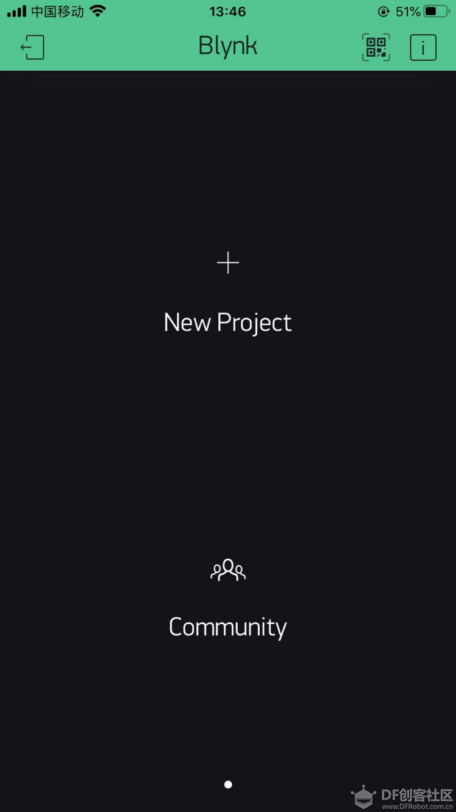

Blynk本地服务器的部署
========================================

Blynk是一个物联网平台，旨在简化物联网的移动和Web应用程序的构建。虚谷号上虽然已经整合了SIoT，但是Blynk也可以同时部署。

----------------------
Blynk简介
----------------------

相对于其他MQTT的服务器来说，Blynk的优势在于连接快速，且提供了免费的移动平台上的配套应用，包括iOS和Android。

Blynk项目分为三个部分：

1.Blynk应用（App）。

Blynk的App是具有易于使用的拖放系统，可为IoT设置构建自定义控件。工作流程非常快速：启动新项目时，系统会提示您从广泛的列表中选择开发板，以及连接方式。然后，该应用通过电子邮件发送授权令牌，以通过Blynk服务器连接到您的设备。

.. image:: ../images/08/8.7-blynk.jpg

应用中的提供了很多小部件。每个小部件都有一个编辑菜单，可让您更改名称和颜色。然后，您选择要影响的引脚（无论是板上的引脚还是Blynk的虚拟引脚之一）以及要发送的值范围。对于图形或文本框之类的输出显示，您还可以选择更新频率，从而节省宝贵的带宽。

Blynk还具有将指令分配给“虚拟”引脚的功能，这是用户配置的应用程序与硬件之间的连接。因此，应用程序中的单个按钮可用于触发设备上的许多不同事件。

2.Blynk云服务器。

创建了用于控制设备的应用后，您可以有两种方法与之通信。第一选择是用Blynk云服务器。这个服务器快速，响应迅速且免费使用。连接到Wi-Fi设备就像将生成的授权代码复制到Arduino草图中并提供Wi-Fi详细信息一样容易。

第二个选择是自己部署Blynk服务器。 Blynk提供了一个基于Netty的开源Java服务器，可以从您的计算机甚至Raspberry Pi、虚谷号(vvboard)、拿铁熊猫(LattePanda)之类的迷你电脑来运行该服务器。在功能和安全性方面，这为某些用户带来了各种好处。

3.Blynk库。

Blynk提供了完善的Blynk库。该库与大量开发板一起使用，以允许该应用程序与您的硬件之间进行通信。

Blynk官方网址：https://blynk.io/

---------------------------------------
在虚谷号上部署Blynk服务器
---------------------------------------

虚谷号部署Blynk本地服务器，其实也比较简单，可以通过jupyter的终端、ssh或者远程桌面来执行下面的命令。

1. 查看虚谷号java版本。打开桌面LX终端，输入java -version，显示8.0版本。

2. 下载Blynk服务器jar文件

1)在lx终端内输入 wget "https://github.com/blynkkk/blynk-server/releases/download/v0.41.12/server-0.41.12-java8.jar"，但是速度奇慢，传输容易断不续传，不建议。

2）直接浏览器下载https://github.com/blynkkk/blynk-server/releases/download/v0.41.12/server-0.41.12-java8.jar

3）为了方便，将下载的文件移动到/home/scope/下。

**注：**可以在自己的电脑下载，然后通过jupyter上传。

3. 虚谷内置的SIoT使用8080端口和Blynk服务端口冲突，我将SIoT的端口修改为8088，打开/home/scope/software/SIoT_1_2_vvBoard/下的config.json进行修改保存。

.. image:: ../images/08/8.7-3-siot.png

4. 打开LX终端,输入以下命令，在默认的“硬件端口8080”和默认的“应用程序端口9443”（SSL端口）上运行服务器
java -jar /home/scope/server-0.41.12-java8.jar -dataFolder /home/scope/Blynk
看到Blynk Server successfully started,那就恭喜你成功了，第一次安装还会提示用户名和密码，忘记截图了，这里写下用户名为admin@blynk.cc，密码为admin。

.. image:: ../images/08/8.7-4.png

5. 打开手机app Blynk，选择custom，输入虚谷号的IP地址（我的为192.168.0.107），端口号不要修改。

.. image:: ../images/08/8.7-5.png

6. 输入账号admin@blynk.cc，密码admin，登陆出现以下界面就OK了。

----------------------
Blynk范例
----------------------
待完善

----------------
参考资料
----------------

参考网址：https://mc.dfrobot.com.cn/thread-302809-1-1.html

