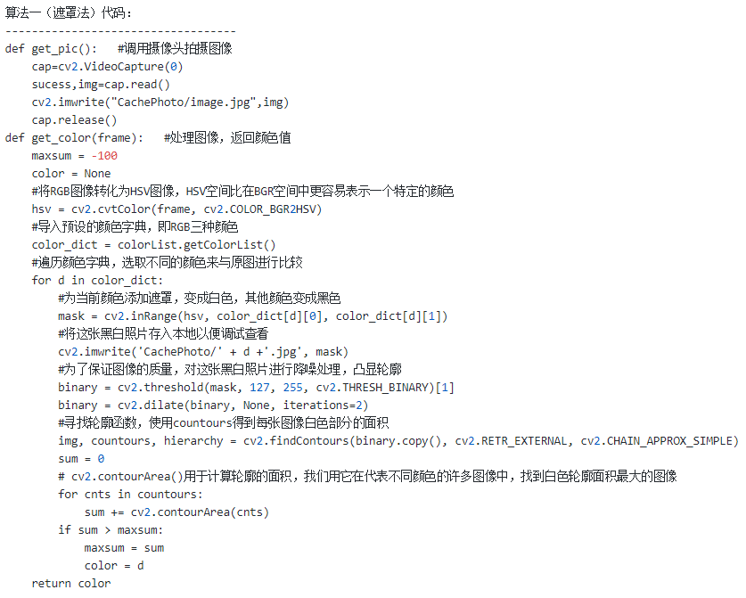
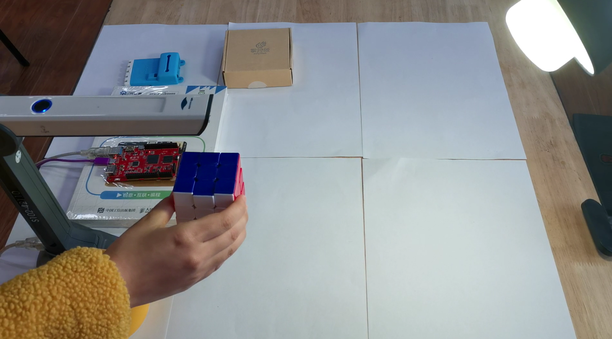

案例简介
===========================

支持手机APP控制的智能灯泡很多, 但是能够让用户自行编程控制的却寥寥无几。研究了市场上常见的开放接口的智能灯泡, 总结出自定义编程大致有两种方式:一是智能灯泡的物联网网关支持第三方认证接入, 如天猫精灵;二是智能灯泡同时支持局域网内部的控制, 如Yeelight。

默认情况下，yeelight智能灯泡与物联网网关建立联系，然后手机App通过网关发送控制指令给灯泡，每一个智能灯泡都是一个智能终端。但是，yeelight智能灯泡如果开启了“局域网控制”功能，那么就可以同时响应来自局域网任一智能设备的控制指令了，发送控制指令的设备可以是电脑、手机，也可以是任何一个支持网络功能的MCU，如掌控板、虚谷号和树莓派等。

我们能利用虚谷号和智能灯泡做出怎样的案例呢？DF论坛上有人发了一篇关于制作“变色龙”的文章，大都是利用RGB全彩LED灯珠或灯带，结合颜色识别传感器，做能够根据环境颜色发出不同光芒的“变色龙”。这一作品激起很多创客的兴趣，于是大家就进一步改造，让这个“会变色”的作品越来越好玩。

这类变色主题的作品再多，也无非是利用了颜色传感器，控制的还是REG灯，在我们看来都不够好玩。在研究利用Wi-Fi控制互联网智能灯泡的过程中，我们发现只要遵循一定的协议，控制物联网家电并非难事。于是，我们想到了利用虚谷号来控制Yeelight灯泡，做一个智能变色灯。和其他作品不同的是，我们用摄像头或者高拍仪来代替颜色传感器，控制的是220V的“真正灯泡”。

原理分析
===========================

之所以用摄像头来替代颜色传感器，是因为前者不仅便宜，而且随处可以获取。利用摄像头获取颜色，可以借助于Python中OpenCV库，调用摄像头拍照，并对拍到的图像进行处理分析，将图像中的主要颜色分解为RGB三种颜色数值，再通过局域网发送控制指令使智能灯泡变色。Yeeligh灯泡支持局域网控制，能够接收到局域网内任一智能设备的控制指令，用虚谷号控制智能灯泡的原理，这里不作详细介绍。

这个智能变色灯需要的器材很少，只需要虚谷号加yeelight智能灯泡、摄像头就可以了，作品的工作流程图如下。

.. image:: ../images/09/yeelight01.png

用摄像头获取物体颜色的代码实现
=============================

摄像头前物体是什么颜色？看起来问题很简单，但是让计算机来回答并不容易。当我们要判断某个物体是什么颜色的时候，往往会先找出这一物体的最主要颜色，再判断这一颜色和哪种颜色最接近。计算机虽然说不出天蓝、橘黄之类的色彩名词，但可以精确地分析出图像中某一个像素点的RGB值，即RGB三种颜色的具体组成，但一个物体往往不会是纯色的，所以要确定一张含有多种颜色的图像的“颜色”，需要确定一个算法。

算法一：将这个图像的所有像素点的RGB值分别相加，取出RGB三种颜色的平均值。如果担心计算的效率太低，可以均匀地取出部分像素，应该可以得到大致的颜色平均值。

算法二：利用滤镜功能，给这个图像加上RGB三种颜色遮罩，处理为黑白图片，然后通过计算分别得到图像的白色区域面积大小，换算为0-255之间的数值。

.. image:: ../images/09/yeelight02.png

其实，这两种算法的原理是差不多的，只不过实现的方式不一样。OpenCV库作为著名的跨平台计算机视觉库，提供了很多图像处理和计算机视觉方面的通用算法，可以很简单地帮我们完成颜色分析的功能。

算法一（遮罩法）部分代码：
-----------------------------------

算法二（取点法）部分代码：
-----------------------------------

.. image:: ../images/09/yeelight04.png

虚谷号控制物联网灯泡的代码实现
=============================

为方便用户控制灯泡，Yeelight公司提供的一个小型库，可让用户通过Wi-Fi发送指令来控制Yeelight灯泡。只要获取了设备的IP地址，通过ON、OFF、Set_Color等简单的函数，就能调整灯泡的开关、颜色、亮度等参数。

需要强调的是，Yeelight灯泡要开启“局域网控制”功能，默认情况下这一功能是关闭的。另外，虚谷号和Yeelight灯泡一定要处于同一局域网，即连接同一个无线路由器，才能通过指令来找到设备的IP地址。

控制灯泡颜色的参考代码如下：

.. image:: ../images/09/yeelight05.png

我们在虚谷号的论坛中，提供了更多关于Yeelight库的教程，可以在”创意项目”中找到，地址如下：
http://vvboard.net.cn/bbs/

实例运行
=============================

其他有关yeelight的案例
=============================

我们还提供了有关yeelight灯泡的一系列课程，可以在github上下载

https://github.com/vvlink/yeelight

课程内容包括：

基本操作

- 01	寻找设备（列出地址）

- 02	控制单一设备状态（两种方式）

- 03	控制单一设备亮度

- 04	控制单一设备色彩（RGB方式）

- 05	控制多个设备联动（逐个亮起）

互动操作（使用xugu库）

- 06	按钮控制灯（按钮传感器）
    用按钮控制开、关灯，使用切换状态函数
    
- 07	人体红外感应灯（人体红外热释电）
    感应人体活动信息后，延时1分钟（采用计时的方式）
    
- 08	自动感应夜灯（光敏、声音）
    光线暗时，听到声音就亮起，一会儿关闭

综合应用

- 11	调色灯
        使用三个旋钮控制RGB数值

- 12	智能变色灯（摄像头）
        在摄像头放置不同颜色的物体，灯泡自动改变颜色。
        
- 13	天气灯
        定时自动获取天气，设置相应的灯泡颜色
        
- 14	语音智能灯（麦克风、百度AI）
        用语音控制开灯、关灯和亮度等指令

