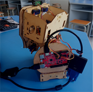
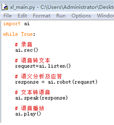
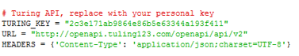
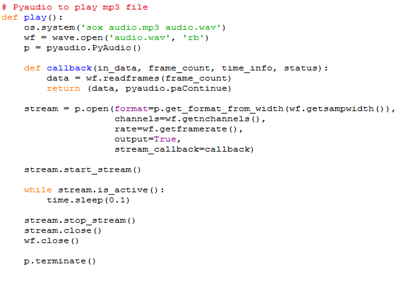

做一个语音交互机器人“小胖”
================================================================

案例编写：于方军（淄博）

“小胖”是进化者公司为孩子设计的机器人，它具备强大的语音交互功能，能根据主人要求自行走动，回答各种难题。聊天机器人作为人工智能应用层面的入门课例，容易激发学生的兴趣，帮助学生能够快速的感知人工智能的应用情景。虚谷号是一个面向人工智能教学和Python编程学习的中国原创开源硬件平台，为人工智能和Python编程教学提供完整课程资源包。本课例通过虚谷号搭建硬件平台，通过图灵机器人（www.tuling123.com ）和百度AI两个软件平台，引导学生学会连接这些平台做一个属于自己的个性化语音聊天机器人。

------------------------------
案例描述
------------------------------

本课程的设计步骤采用循序渐进的方式，便于学生由简到繁，逐步深化提高,使学生较好的理解语音聊天机器人的实现原理，进而了解人工智能的语音识别应用，从而启发学生发挥创意开发属于自己的人工智能作品。

课程设计了编辑两种聊天机器人：一是借助图灵平台，通过调用request和json库，实现简单的文本聊天机器人程序，使学生对聊天机器人程序的问答过程有个初步概念；二是借助百度语音平台，使用虚谷号架设聊天机器人实物框架，实现当机器人说话时，伴随回复的语音，实现机器人嘴巴一张一合，使学生通过构建一个实物语音聊天机器人，经历一件人工智能作品创作的体验。

教学过程主要体现了函数层面的模块化教学，通过将功能封装成库，再调用库的方法，带学生一起，打开“人工智能”的“黑盒子”，理解语音聊天机器人的“听”、“思”、“说”的过程：

听——它能听得懂？主要通过录音、语音转文本两个活动依次理解智能语音聊天机器人程序“听懂”的过程。使学生理解人工智能就其本质而言，是对人的思维的信息过程的模拟。

思——它会思考吗？借助图灵机器人平台，上传一个json格式的请求（包含聊天内容和个人信息等），获取到回复。再从收到的对象中提取出回复的文本。理解智能语音聊天机器人程序“思考”的过程。理解人工智能可以模拟人的意识和思维，它虽然不是人的智能，但却能像人那样思考，也可能超过人的智能。

说——它是怎么说话的？主要通过探究“文本转语音”和“播放语音”两个活动理解智能语音聊天机器人程序“说话”的过程。使学生理解智能语音机器人的“说”和我们人类的“说”的本质区别。

------------------------------
原理分析
------------------------------

SpeechRecognition（录音）--> 百度语音（Speech-to-Text语音 转文本）--> 图灵机器人（语义分析及应答）--> 百度语音（Text-to-Speech文本转语音）--> PyAudio（音频播放）

虚谷号运行完整的Linux系统，连好USB声卡后，打开虚谷号的音量控制

在配置项里面只保留USB声卡，把其他设备都关闭。

1. 安装 SpeechRecognition：

pip install SpeechRecognition

SpeechRecogintion 是 Python 的一个语音识别框架，已经对接了如谷歌和微软的 STT （语音转文本）服务。本课例的语音识别及合成用的是百度的开放服务，所以只是需要 SpeechRecogintion 的录音功能。它可以检测语音中的停顿自动终止录音并保存。

2.安装IDEL

sudo apt-get install idle3

IDLE是开发 python 程序的基本IDE（集成开发环境），具备基本的IDE的功能，是非商业Python开发的不错的选择。运行上面代码后安装了Python3.0的集成开发环境，相对于虚谷号预装的jupyter开发环境，IDLE运行占用资源少。

3.升级pip到19.0.3

pip install --upgrade pip

pip 是 Python 包管理工具，后期的包安装用到pip，以上代码是升级到最新版。

4.安装PyAudio

Linux 系统下可以直接使用系统自带的包管理器安装 PyAudio （如 Ubuntu 和 Raspbian 系统的 apt-get），可以使用 pip 命令安装，不过需要提前装好编译用
的依赖portaudio19，

Sudo apt-get install portaudio19-dev

pip install --upgrade pyaudio

5.语音识别代码

创建应用:：百度语音是百度云 AI 开放平台提供的支持语音识别和语音合成的服务，注册以后就可以直接访问它的 REST API 了，并且有向普通用户提供免费的调用额度。

注册成功以后，进入语音服务的控制台创建一个新的应用，记下自己的 AppID、API Key 和 Secret Key。

语音识别代码，百度 AI 有提供面向 Python 的框架 baidu-aip ，这里直接使用该框架。安装：

pip install baidu-aip

把代码中的 Key 替换成自己的，将 SpeechRecognition 录制的音频上传至百度语音的服务，返回识别后的文本结果并输出。

.. image:: ../images/09/vrobot04.png

6.图灵机器人

图灵机器人是一个提供（一定额度内）免费的智能聊天服务的平台，注册以后就可以创建自己的聊天机器人并接入到项目中。首先进入图灵机器人的控制台并创建一个新的聊天机器人，记下分配到的 apikey。

在代码中配置为自己的apikey

上传一个聊天内容，获取到回复。再从收到的对象中提取出回复的文本。

.. image:: ../images/09/vrobot07.png

7.百度语音（TTS）

百度的文本转语音（TTS）引擎语音效果很好，其中的”spd”设置调节语速，vol调节音量，per选择人物，我们这里选择4号丫丫。在本程序中定义了一个speak函数完成这部分功能。

.. image:: ../images/09/vrobot08.png

就是把需要转换成语音的文本内容上传，再将返回的数据保存在本地。貌似只能生成 mp3 格式。

8.PyAudio 播放
本课例中调用系统中的 sox 命令将 MP3 转为 wav 格式，再用 PyAudio 播放。SoX 是一个强大的跨平台的音频处理工具，Linux 系统可以直接使用包管理器安装：

sudo apt-get install sox libsox-fmt-mp3

通过上述配置后，插上耳麦，你就能实现和机器人进行语音聊天了。由于百度的录音时间设置，如果超过60秒没有检测到麦克风输入，会报错停止程序，我们要再次启动程序。你还可以通过设置图灵平台的后台设置，让你的机器人更个性化。

.. image:: ../images/09/vrobot10.png

基于虚谷号的语音聊天机器人可以开发的功能丰富，既可以从小处着手，开发小型的适合一个学生独立完成的项目，也可以开发比较大型的适合团队完成的项目。在本课例中使用虚谷号完成语音聊天机器人作品的同时，不只是学习人工智能的应用技术，更重要的是在教育活动中融入了创客精神和内涵，提高学生的创新意识和实践能力，将学习者培养成为有创客精神的人。这也正是虚谷号的初心与坚持所在。

