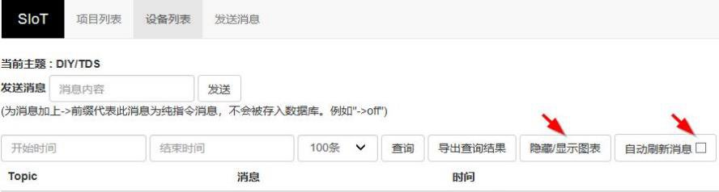
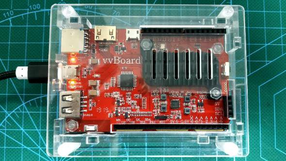
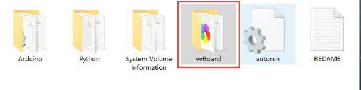
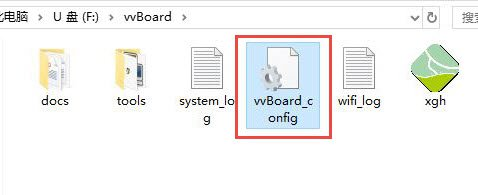
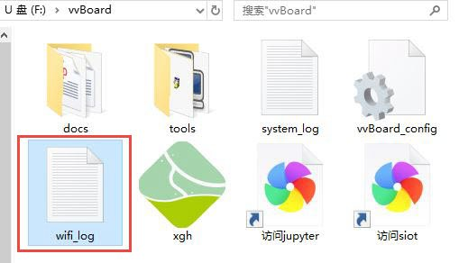
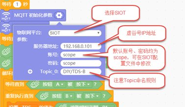
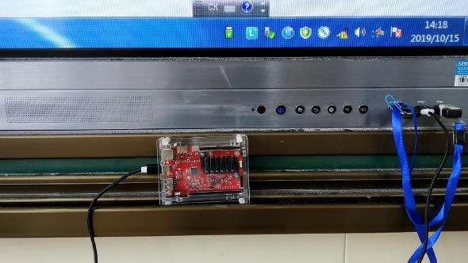
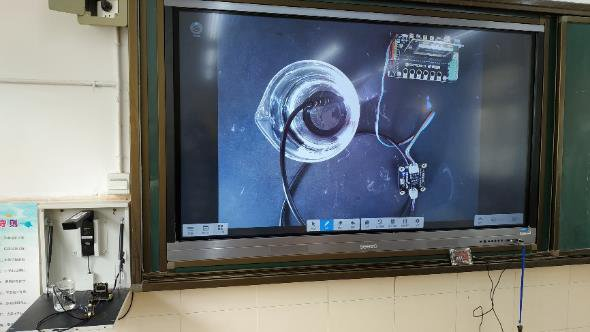
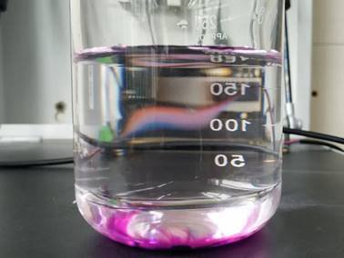

虚谷号让食盐在水中的扩散过程“可见”
========================================================

案例编写：狄勇（宁波）

教育科学出版社小学科学教材四年级上册安排有“溶解”知识单元。在“物质在水中是怎样溶解的”一课中，为了让学生清晰观察到物质溶解过程，教材要求采用高锰酸钾这样有颜色的物质代替食盐做溶解实验。作为最安全、廉价、易取得的实验对象，传统实验方法显然对扩散过程透明的食盐束手无策，只能在高锰酸钾溶解实验的基础上让学生通过想象进行认知迁移。有没有一种方法让食盐的扩散过程可被检测和观察到呢？其实借助虚谷号搭建的SIoT服务器以及由掌控板和TDS传感器制作的检测装置，我们可以变通下用数据可视化的方法让食盐在水中的扩散过程“可见”。

-----------------------------------------------------
实验原理简介
-----------------------------------------------------

参考教材针对高锰酸钾的实验设计，实验装置主要被设计用于观察搅拌前的食盐溶解情况。我们需要寻找一种可以检测到盐分的传感器以量化该扩散过程。
大量程的电导率传感器是最适合的选择，但相对廉价许多的TDS传感器也可用于该部分实验。

TDS中文名称为总溶解固体（英文：Total dissolved solids，缩写TDS），又称溶解性固体总量，测量单位为毫克/升（mg/L）,它表明1升水中溶有多少毫克溶解性固体。TDS值越高，表示水中含有的溶解物越多。总溶解固体指水中全部溶质的总量，包括无机物和有机物两者的含量。一般可用电导率值大概了解溶液中的盐份，一般情况下，电导率越高，盐份越高，TDS越高。由于天然水中所含的有机物以及呈分子状的无机物一般可以不考虑，所以一般也把含盐量称为总溶解固体。

开始实验前，应在教室内部署一台路由器，该路由器无需连接外网，仅负责局域网内数据中转。虚谷号、掌控板、教室电脑均连至该路由器以实现数据互通。教室电脑提前打开浏览器访问虚谷号的SIoT后台，勾选自动刷新消息，做好数据实时呈现的准备。

实验时将一勺食盐轻轻放入烧杯中，静观食盐的变化。短时间内，沉入水底的食盐颗粒并不会有肉眼明显可见的变化发生，但扩散过程从食盐入水的一刻已经开始。此时可将TDS传感器插入烧杯中，并缓缓上下移动探头，检测不同水位的TDS值，检测到的数据将通过掌控板发送给搭建在虚谷号上的SIoT服务器进行记录，并自动生成图表实现数据可视化。学生将从教室大屏幕呈现的折线图实时看到不同水位的TDS值，帮助理解和想象食盐在水中的扩散过程。

---------------------------------------
在虚谷号上搭建SIoT服务器
---------------------------------------

SIoT已在虚谷号出厂预装。作为一个开源物联网项目，若被删除，可至GitHub下载针对vvboard的版本安装。（网址：https://SIoT.readthedocs.io/zh_CN/latest/）
虚谷号部署SIoT的步骤如下：

1.将USB线连至虚谷号的OTG口

2.稍后系统会将虚谷号识别为一个U盘

.. image:: ../images/10/TDS_003.jpg

3.打开vvBoard的文件夹

4.用记事本编辑vvBoard_config文件

将SSID和SSID_PSD改为局域网的WIFI账号密码，保存配置文件。

5.重启虚谷号，双击“访问siot”

.. image:: ../images/10/TDS_006.jpg

正常情况下，此时浏览器应呈现SIOT的后台登录页面

.. image:: ../images/10/TDS_007.jpg

如果未自动生成包含虚谷号IP地址的快捷方式，可再次进入vvBoard文件夹，打开其中的wifi_log日志文件。

.. image:: ../images/10/TDS_008.jpg

如图，虚谷号的IP地址为192.168.0.1，

访问http://192.168.0.101:8080/html/

即可打开后台页面。

--------------------------------
实验装置的硬件搭建
--------------------------------

材料清单
虚谷号×1
掌控板×1
掌控I/O扩展板×1
Gravity模拟TDS传感器×1
配合掌控I/O扩展板以及Gravity: 模拟TDS传感器，装置的搭建实现了模块化。将TDS传感器的信号线依据颜色对应的原则接到扩展板的P1口，插上掌控板，实验装置便组装完成了。简便的搭建过程为大班应用提供了可能。

.. image:: ../images/10/TDS_011.jpg

--------------------------
实验装置程序设计
--------------------------

掌控板的程序设计由DFROBOT的Mind+软件完成。功能上设计为按A键，开始检测和上传TDS传感器返回的数据，按B键停止检测和上传数据。检测和上传数据间隔时间1秒，契合上下移动探头并记录TDS值的节奏。如此短暂的记录间隔，让小学生人工实现几乎是不可能完成的任务。

.. image:: ../images/10/TDS_012.jpg

MQTT初始化参数的正确设置是数据成功上传到虚谷号SIOT服务器的关键。尤其需要注意Topic的命名规则，务必加上“/”。平台默认账号、密码均为scope，可在SIOT配置文件中自行修改。
 
--------------------------
系统测试
--------------------------

测试发现TDS传感器对盐分非常敏感。

.. image:: ../images/10/TDS_014.gif

依照前述实验步骤投放食盐，

.. image:: ../images/10/TDS_015.gif

然后缓缓下方探头，可见TDS值迅速升高，在接近底部时达到传感器量程极限。提升探头时，TDS值又逐渐下降。

.. image:: ../images/10/TDS_016.gif

后台实时刷新的折线图

.. image:: ../images/10/TDS_017.jpg

以EXCEL格式导出的数据
鉴于Mind+没有提供使用掌控板作为主控时的TDS传感器插件，本套装置记录的数据为未经标定的模拟量。即便如此，用以反馈盐分浓度的变化趋势，还是恰当的。

--------------------------
课堂实践
--------------------------

虚谷号在课堂上可以用充电宝、外接电源等供电。

如果教室有电脑，直接插上USB接口即可。为其供电外，也方便直接访问U盘模式下的网页快捷方式打开SIOT后台页面。

课上借助实物展台向学生简介了我们的数字化实验装置，并一笔带过TDS的概念。关键是让学生清楚数值越高，水中的盐分越高。

教材安排的高锰酸钾溶解实验照旧进行了演示。这样既有高锰酸钾溶解过程的形象化迁移，又有虚谷物联提供的可视化数据支撑，可进一步帮助学生形成认知。 
课堂上的实验效果与测试时接近。

.. image:: ../images/10/TDS_021.jpg

大屏幕上伴随探头位置实时刷新的折线图，让学生从数据的视角看到了食盐的扩散过程，有效注意被显著激发。

--------------------------
实验小结
--------------------------

经过3个平行班的教学实践，发现学生对基于虚谷物联的实验接受度良好。改进的实验方法以数据和图表的形式，让食盐的扩散过程明晰可见。或许实验设计严谨性上有所欠缺，但相较于传统实验手段面对食盐的无能为力，确实实现了从无到有的进阶，教学上可以作为高锰酸钾溶解实验的补充。感觉谢老师团队力求将数字化实验室成本降维式压低的阶段性成果已经达成。基于虚谷号+掌控+SIoT的组合，只需外加个显示器，或者干脆直接用手机登录后台，即便是在没有电脑的课堂依然可以实施基于物联网的数字化实验。当然，成本低廉不足以让这套组合具备绝对优势，以下特质的加持，让虚谷物联在数字化实验探究方面拥有更广阔的想象空间。

1.部署便捷
一次配置，日后便可即插即用。适合演示实验的数据记录和呈现，也适合于分组实验。分组实验时只需给每组定义不同的Topic即可。而且即便中途断电，SIoT后台记录的数据依然完好。

2.无惧户外实验配合充电宝，虚谷物联可以在户外实验中大展拳脚，让数字实验室延伸到操场、小区，乃至田野、山间。

3.开放与包容开源硬件+开源软件+通用接口，使得虚谷物联组合拥有无与伦比的兼容性。自己DIY的数字化实验室，接什么传感器，拓展什么功能，自己说了算。只要高兴，天天改良升级。

都说未来已来，我们作为老师不仅要让学生适应当下数字化的世界，还要让“数字土著一代”体验和探索链接真实问题的数字化创新。与学科结合的虚谷物联应用，会是一方不错的基石。
