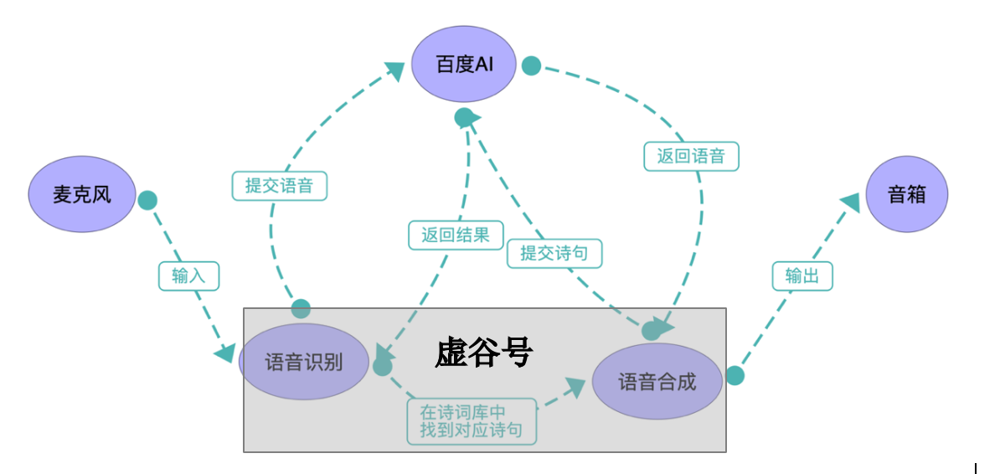
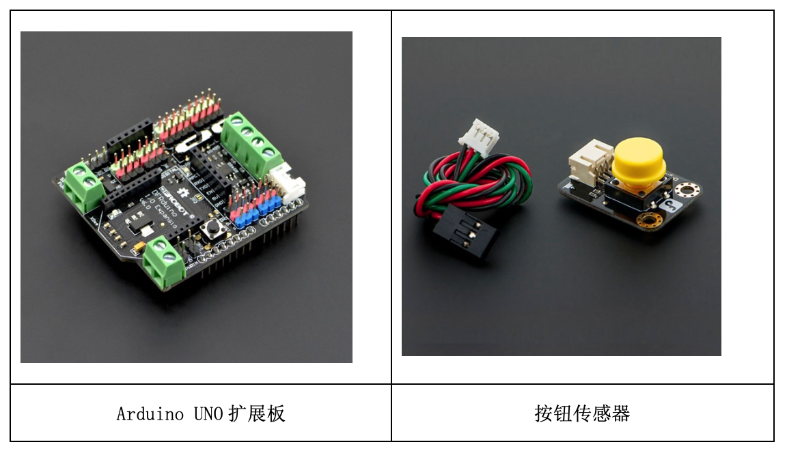
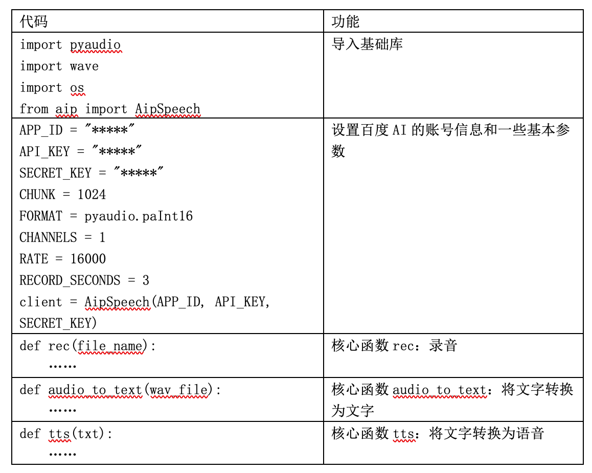
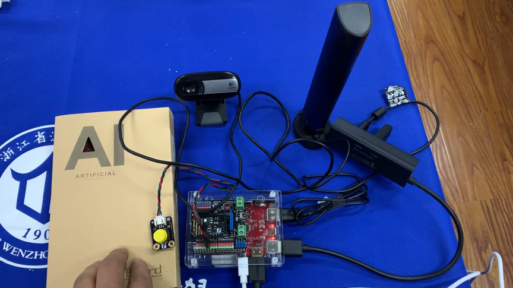

会“吟诗作对”的机器人
========================================================

案例提供：谢作如（温州）

聊天机器人是人工智能的一个重要应用模式。苹果手机中的Siri、Win 10中的小娜和百度的小度，还有小爱音箱和天猫精灵等，都是大家很熟悉的聊天机器人。这些机器人不仅可以聊天，还能帮用户做很多事情，比如查天气预报、设置闹钟，甚至还可以在线购物。

看多了功能强大、近乎全能的商业聊天机器人，难免有些审美疲劳。如果设计一款仅仅针对某个专业领域的聊天机器人，反而能吸引特定用户的眼球。想到最近中国诗词大会很红，我们就萌发一个有趣的想法——做一个可以吟诗作对的机器人。用户读上一句，机器人对出下一句，是不是很酷？或许可以激发学生学习古诗词来考考机器人的兴趣呢。

---------------
原理分析
---------------

从信息系统的角度看，聊天机器人的“听”和“说”仅仅是信息的输入和输出，核心功能在于聊天的内容，如何体现“智能”。但是对这款机器人而言，难点反而不是聊天内容的处理，而是如何识别语音和发出人声，即语音识别和语音合成。因为“吟诗作对”的定位，已经确定了这个机器人不需要回答各种稀奇古怪的问题，关注的仅仅是古典诗词方面的一问一答，问题和答案都是固定的，只要提供足够大的诗词库即可。

聊天机器人的核心硬件，我们选择了虚谷号。虚谷号是一块运行Linux系统的迷你电脑，预装了Python3.5。虽然根据虚谷号的当前算力，在本地处理语音还有些“吃力”，但是借助于百度AI开放平台，或者腾讯AI开放平台，只要连上网络就能识别语音和合成语音。这个“吟诗作对”机器人的系统流程如图所示，虚谷号仅仅作为一个采集语音和播放语音的智能终端，语音处理工作全部在云端完成。这种做法和现有的聊天机器人在工作原理基本上是一致的，比如离开网络，天猫精灵也好，小爱音箱也好，都没办法和我们对话了。

“吟诗作对”机器人的系统流程图

---------------
原型设计
---------------

如果不考虑设计一个人形的结构，这个聊天机器人的组成一点都不复杂。核心模块清单如下：

	- 1.虚谷号*1；
	- 2.USB声卡*1
	- 3.麦克风*1
	- 4.小音箱*1

.. image:: ../images/09/9.7-poem02.png

虚谷号支持绝大多数免驱的USB声卡，即插即用。当然，我们也可以选择自带声卡的小音箱。常见的摄像头往往也集成麦克风，也能够使用。但是，考虑到常见的聊天机器人都是用“语音唤醒”技术的，而当前虚谷号的固件还没有集成这一功能，需要安装好几个必要的库。此外，我们选择了用“按下按钮” 的方式来和机器人交互。类似唤醒Siri的方式，要按下手机的电源键。因而，还需要一块Arduino扩展板和普通按钮传感器，这在创客空间里面是很常见的。

---------------
编程控制
---------------

给虚谷号编程的最好方式当然是通过Wi-Fi了，即无线模式。虚谷号内置了Jupyter，通过U盘方式正确设置Wi-Fi信息后，就会自动生成快捷方式，打开浏览器即可编程。访问“vvBoardBook”文件夹，将看到很多范例。其中就有GPIO、百度AI和语音处理方面的笔记。

核心代码如下：

有了前面的基本库和函数后，下面的Python代码编写其实就很简单了。首先是添加诗词库。限于篇幅，我们用一个列表“shici”来存储诗句。
::
	shici = ['床前明月光', '疑是地上霜', '举头望明月','低头思故乡']
	shici.extend(['大漠沙如雪', '燕山月似钩', '何当金络脑','快走踏清秋'])
	shici.extend( ['小时不识月','呼作白玉盘','又疑瑶台镜','飞在青云端'] )

接下来是主体程序。在这段代码中，按钮传感器接在D4口，按下后虚谷号开始说提示语：“请开始背诵古诗。”。当用户背“床前明月光”，虚谷号如果能够正确识别，将对出下一句“疑是地上霜”。即用户读前一句（奇数），机器对出下一句（偶数）。
::

	from xugu import Pin
	import time # 导入时间模块
	p = Pin(4, Pin.IN) 
	while True:
	    value=p.read_digital() # 读取 4 号引脚电平信息,赋值给 value
	    if (value==1):
	        tts("请开始背诵古诗。")
	        ret_s = audio_to_text(rec("input.wav"))
	        for i in range(len(shici)//2):  
	            if shici[i*2] in ret_s:
	                back=shici[i*2+1]
	                break
	            else:
	                back="在下才疏学浅，甘拜下风。"
	        tts(back)
	    time.sleep(0.1) # 等待0.1秒

注：完整的代码见“虚谷号内置课程”。

---------------
功能测试
---------------
	
完成好这个简单“吟诗作对机器人”后，我们迎来了温州中学的对外公开课。上课的课题是“初识人工智能”，除了现场的近百人，网络直播人次达到了两万多。在这节公开课上，我们演示了这一机器人的基本功能，的确很好地激发了学生的学习兴趣。他们尝试修改Python代码，以实现更多的功能。只要网络足够快，对话过程非常流畅，几乎没有“延时”的感觉。

视频链接：https://www.bilibili.com/video/av91289004/

在课堂上，学生们提出了一些新的想法。如设计成“飞花令”机器人，让诗词对话更加好玩；设计成迎宾机器人，向来宾介绍学校的校训和历史；设计成“识字”机器人，学生将不认识的字放在摄像头下，虚谷号告诉他们这个字的读音和意思……

每一次打开Jupyter在运行代码当然有点麻烦。其实虚谷号提供了多种启动Python代码的方式。最简单的做法是：将“.py”文件复制到在U盘的Python文件夹，命名为“main.py”，然后按下RST键代码即可运行。如果虚谷号采用了电源口供电，那么不用按RST键，也会自动启动。

---------------
结语
---------------

随着一些知名的AI框架不断开源，人工智能的技术门槛也在不断下降。在虚谷号上不仅可以用调用网络API的形式，利用云端服务器来处理信息，还可以安装TensorFlow、Keras之类的机器学习框架，学习机器学习、神经网络方面的知识。本案例涉及到的代码已经以“.ipynb”文件的形式，放在虚谷号的最新版固件中，采用CC协议开源，期望有更多的创客爱好者能在这段代码的基础上，设计出更多有趣的AI应用。

