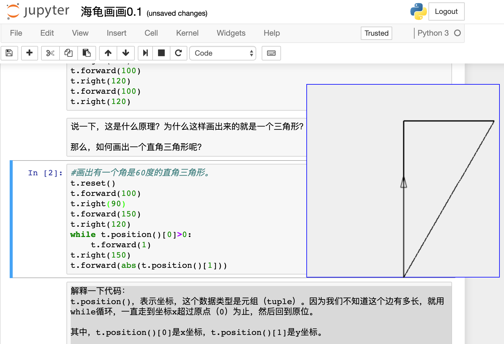

用ipyturtle在网页上画画
====================================

课程编写：谢作如

画画是孩子自由天性的释放 也是孩子内心世界的独白。正因为如此，美国麻省理工学院终身教授西蒙·派珀特（Seymour Aubrey Papert）设计了LOGO语言。他相信计算机可以让孩子们主动构建知识，尤其是数学。

虽然LOGO语言已经非常古老，但很多编程语言对其进行了继承，如著名的儿童编程语言Scratch。很多人学习Python，是基于turtle库，以海龟画画的形式开始入门的。

--------------------------
课程简介
--------------------------

这是一个基于jupyter的海龟画画课程。使用了一个ipyturtle库，jupyter的插件。虚谷号已经默认安装了这些库，这是给小学高年级的孩子学习Python用的入门课程。

如果你使用的是虚谷号，安装方法就可以略过。

https://github.com/gkvoelkl/ipython-turtle-widget

安装方法：

pip install ipyturtle jupyter nbextension enable --py --sys-prefix
ipyturtle

如果pip不能安装，可以试试pip3。

好了，开始画图吧。

--------------------------
准备工作
--------------------------

首先是导入库，然后显示出来，看一看，是不是出现图片了？

::

    from ipyturtle import Turtle
    t = Turtle()
    t

如果觉得画布太大，那就设定画布大小，小一点。试一试。

::

    # 先关闭
    t.close()

::

    # 再画一个
    t = Turtle(fixed=False, width=100, height=100)
    t

接下来要考一考大家：

默认情况下，三角形指示牌的坐标在“0，0”的位置，运行下面的代码，t的坐标在哪里？

::

    t.back(20)
    t.forward(60)

有没有发现，三角形指示牌移动了？我们输出坐标吧。

:: 

    t.position()

--------------------------
语法介绍
--------------------------

解释一下，back表示后退，forward表示移动，括号中的数字单位是像素。因为后退了20，再前进60，实际上是40，所以坐标在“0.0,
40.0”。那么Turtle还支持哪些操作呢？

-  移动：forward()，back() 表示前进多少步,后退多少步，括号里面表示像素。
-  转弯：right(10)、left(20) 右转和左转，括号里面表示角度。
-  收起画笔：penup()
-  重新开始：reset()

我们试一试吧，画一条线，长度是50像素的水平线。

:: 

    from ipyturtle import Turtle
    t = Turtle(fixed=False, width=200, height=200)
    t

:: 

    t.right(90)
    t.forward(50)

\*\* 总结一下：\*\*
要先显示t，然后移动坐标，就能看到图案，不然看到的是最终结果。

--------------------------
画出基本形状
--------------------------

:: 

    # 长度是100，高度是50的矩形
    from ipyturtle import Turtle
    t = Turtle()
    t

:: 

    #画出矩形
    t.forward(50)
    t.right(90)
    t.forward(100)
    t.right(90)
    t.forward(50)
    t.right(90)
    t.forward(100)

看一下，是不是画出了矩形？

:: 

    #先清除原来的结果
    t
    t.reset()

--------------------------
如何画三角形
--------------------------

这个可是难题了。

:: 

    #画出三角形
    from ipyturtle import Turtle
    t = Turtle()
    t

:: 

    t.forward(100)
    t.right(120)
    t.forward(100)
    t.right(120)
    t.forward(100)
    t.right(120)

说一下，这是什么原理？为什么这样画出来的就是一个三角形？

那么，如何画出一个直角三角形呢？

:: 

    #画出有一个角是60度的直角三角形。
    t.reset()
    t.forward(100)
    t.right(90)
    t.forward(150)
    t.right(120)
    while t.position()[0]>0:
        t.forward(1)
    t.right(150)
    t.forward(abs(t.position()[1]))

解释一下代码：
t.position()，表示坐标，这个数据类型是元组（tuple）。因为我们不知道这个边有多长，就用while循环，一直走到坐标x超过原点（0）为止，然后回到原位。

其中，t.position()[0]是x坐标，t.position()[1]是y坐标。

问题：abs(t.position()[1])表示什么？

**知识链接**：while 后面跟着的是表达式，只要表达式成立，那么就一直循环。

思考：能不能用勾股定理算出边长，然后回到原点？

如：math.sqrt(100**2+150**2)。

如果使用sqrt，需要导入math库。在头部要加上一句“import math”

--------------------------
写个函数吧
--------------------------

:: 

    # 正方形
    def square(size):
        for i in range(4):
            t.forward(size)
            t.right(90)

:: 

    t.reset()
    square(100)

**知识链接1**：def square(size)表示一个自定义的函数，square是函数名，size是参数。函数类似一个程序代码的集合，调用起来比较方便。

**知识链接2**：for i in range(4)表示循环4次，分别是0,1，2，3。即从0开始，不包括4。

:: 

    # 画个圆
    def circle():
        for i in range(360):
            t.forward(1)
            t.right(1)

:: 

    t.reset()
    circle()

:: 

    # 画个正三角形
    def triangle():
        for i in range(3):
            t.forward(100)
            t.right(120)
    t.reset()
    triangle()

看这画圆的过程，是不是挺好玩？好了，这个海龟画画的简单教程结束了。
