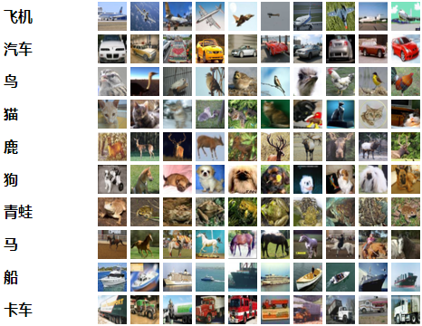
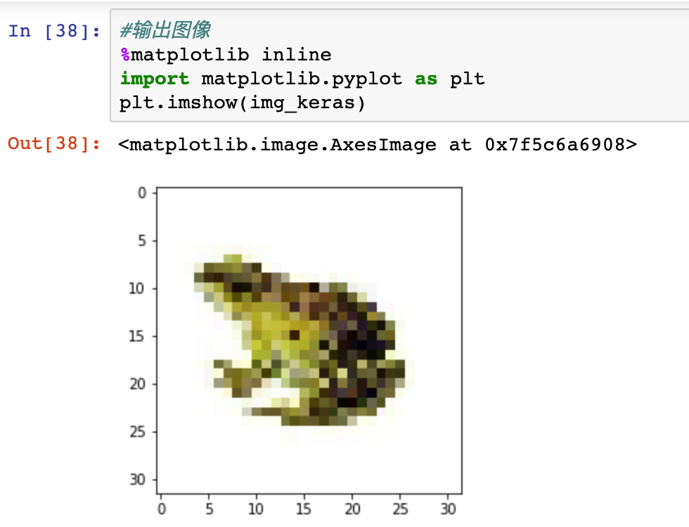

“神经网络和机器学习”系列课程
====================================

课程编写：谢作如

机器学习(Machine Learning, ML)是一门多领域交叉学科，涉及概率论、统计学、逼近论、凸分析、算法复杂度理论等多门学科。专门研究计算机怎样模拟或实现人类的学习行为，以获取新的知识或技能，重新组织已有的知识结构使之不断改善自身的性能。它是人工智能的核心，是使计算机具有智能的根本途径，其应用遍及人工智能的各个领域，它主要使用归纳、综合而不是演绎。

神经网络是计算智能和机器学习的重要分支，在诸多领域都取得了很大的成功。

--------------------------
课程简介
--------------------------

本课程基于TensorFlow和Keras来搭建各种结构的人工神经网络，来处理不同的人工智能经典问题。

TensorFlow最初于2015年发布，是一款开源机器学习框架，易于在各种平台上使用和部署。TensorFlow使用数据流图进行数值运算，张量(“tensors”)可由一系列图形描述的算法来处理，数据在该系统中的变化被称为“流”，因此得名。TensorFlow可用于Python，C ++，Haskell，Java，Go，Rust以及Java等，是机器学习中维护得最好和广泛使用的框架之一。

Keras是一个开源软件库，最初于2015年发布，旨在简化深度学习模型的创建。它用Python编写，可以部署在其他人工智能技术之上，如TensorFlow，微软Cognitive Toolkit（CNTK）和Theano。


--------------------------
准备工作
--------------------------

1）安装必要的Python库。

需要安装的库有TensorFlow、Keras、Pandas、Numpy、OpenCV2等，具体安装命令在课程中可以看到。虚谷号教育版已经安装，可以直接使用。

2）掌控常见的基础库使用。

Pandas、Numpy是课程中经常使用的基础库，需要先了解。

3）收集一些常见的数据集。

--------------------------
课程目录
--------------------------

课程精选了典型应用，提供最简洁有趣的代码。


.. image:: ../images/10/10.4-ml02.png

--------------------------
主要内容
--------------------------

涉及卷积神经网络与循环神经网络之类，并使用神经网络完成广告预测、鸢尾花分类、图片聚类等经典问题。从收集数据、搭建神经网络到训练模型，最后应用模型，经历完整的机器学习过程。最后通过虚谷号获取图片的方式，完成一个综合性的案例——识别“石头剪刀布”的智能机器。

1）常见的神经网络模型及其作用；

2）经典的人工智能案例剖析；

3）数据收集、清洗和整理；

4）模型训练和模型应用。


--------------------------
课程示例
--------------------------

以“卷积神经网络”为例，完成经典的图像聚类。

本案例利用卷积神经网络技术来做图像聚类。CIFAR-10是机器学习领域中一个用于图像识别的常见基础数据集。数据集共有10个类别，分别为airplane（0）、automodile（1）、bird（2）、cat（3）、deer（4）、dog（5）、frog（6）、horse（7）、ship（8）和truck（9）。

案例选择了keras框架，需要先安装keras和tensorflow。虚谷号教育版已经预装必要的库，可以直接使用。因为这个数据集很大，在虚谷号上训练比较慢，建议在电脑上训练。

本案例已经提供了训练好的模型，放在model文件夹中，文件名称为：4-model-vv.h5。如果想直接测试模型，请跳到“应用模型”环节，拍摄或者上传图片开始识别。


```````````````
环境搭建
```````````````

下面是安装命令：

::

	pip install keras
	pip install -i https://pypi.tuna.tsinghua.edu.cn/simple tensorflow

```````````````
数据准备
```````````````

CIFAR-10数据集由10个类的60000个 32 * 32 彩色图像（3个通道）组成，每个类有6000个图像，有50000个训练图像和10000个测试图像。



开始导入数据集吧。第一次使用这个数据集，计算机要先通过网络下载，文件较大（约160M），需要等待一定的时间。建议还是另外下载，放在“~/.keras/datasets/”中。

::

	things_class=["airplane","automodile","bird","cat","deer","dog","frog","horse","ship","truck"]
    import keras
    cifar=keras.datasets.cifar10
    (train_image,train_label),(test_image,test_label)=cifar.load_data()

课程中提供了各种对数据的观察方式。

.. image:: ../images/10/10.4-ml04.png

```````````````
建立模型
```````````````

卷积神经网络的结构一般是将输入的图像进行多次卷积、池化，在多次卷积、池化的的过程中，图像的图像的尺寸会越来越小、特征会越来越明显，最后输入全连接层，完成预测或者分类任务。因此，最后的全连接层的神经元数量要和类别的数量相等。

在keras中可以通过Conv2D和MaxPool方便的添加卷积层和最大层对图像进行卷积和池化，通过以下代码建立卷积神经网络模型并进行编译。

::

    import keras
    from keras import layers
    model=keras.models.Sequential()
    model.add(layers.Conv2D(64,(3,3),activation='relu',input_shape=(32,32,3)))  #第一层要设置输入图片的尺寸（32*32）、颜色通道3
    model.add(layers.Conv2D(64,(3,3),activation='relu'))
    model.add(layers.MaxPool2D()) #池化
    model.add(layers.Conv2D(64,(3,3),activation='relu'))
    model.add(layers.Conv2D(64,(3,3),activation='relu'))
    model.add(layers.MaxPool2D()) #池化
    model.add(layers.Flatten()) #在全连接之前，需要将二维图片数据转换成一维数组
    model.add(layers.Dense(256,activation='relu'))
    model.add(layers.Dropout(0.5))  #为了防止过拟合，Dropout层会随机的丢弃一部分神经网络连接
    model.add(layers.Dense(10,activation='softmax'))  #使用softmax处理多分类问题，一共10个分类
    model.compile(optimizer='adam',loss='sparse_categorical_crossentropy',metrics=['acc']) #在训练过程中打印出准确率（acc）指标

给神经网络模型画图。

.. image:: ../images/10/10.4-ml05.png


```````````````
训练模型
```````````````

::

	model.fit(x=train_image,y=train_label,batch_size=100,epochs=20,validation_data=(test_image,test_label))


```````````````
保存模型
```````````````

训练出来的模型，可以保存。下次使用的时候载入，还可以继续训练。一般保存为h5格式，需要先安装h5py。

::

	model.save('./model/4-model-vv.h5') 


```````````````
载入模型
```````````````

用load_model载入训练好的模型文件，就可以直接用来识别图片了。如果是新版本Keras保存的模型文件，需要加上参数compile=False。

::

	from keras.models import load_model  
	model = load_model('./model/4-model-vv.h5',compile=False)
	#测试一下数据集中的test部分
	model.predict_classes(test_image[0:10])

```````````````
应用模型
```````````````

接下来，要应用这个训练好的模型来识别具体的图片。比如找一些青蛙的图片，保存为png格式，放在“img”文件夹中。

::

    #定义动物的名称
    things_class=["airplane","automodile","bird","cat","deer","dog","frog","horse","ship","truck"]
    #因为模型识别的数据是数组，所以先建一个数组。
    image=[]
    from keras.preprocessing import image as k_image
    # 直接用keras库的image.load_img，image.load_img()只是加载了一个文件，没有形成numpy数组。
    # 参数：grayscale表示是否灰度转换，可以为空；target_size为大小转换，=None为原始大小
    r_img = k_image.load_img('./img/6-1.png',target_size=(32, 32),grayscale=False)
    print(r_img)
    #用image.img_to_array转为array的数组。
    img_keras = k_image.img_to_array(r_img,dtype="uint8")
    print(img_keras.shape)
    #输出图像
    %matplotlib inline
    import matplotlib.pyplot as plt
    plt.imshow(img_keras)




--------------------------
其他资源
--------------------------

